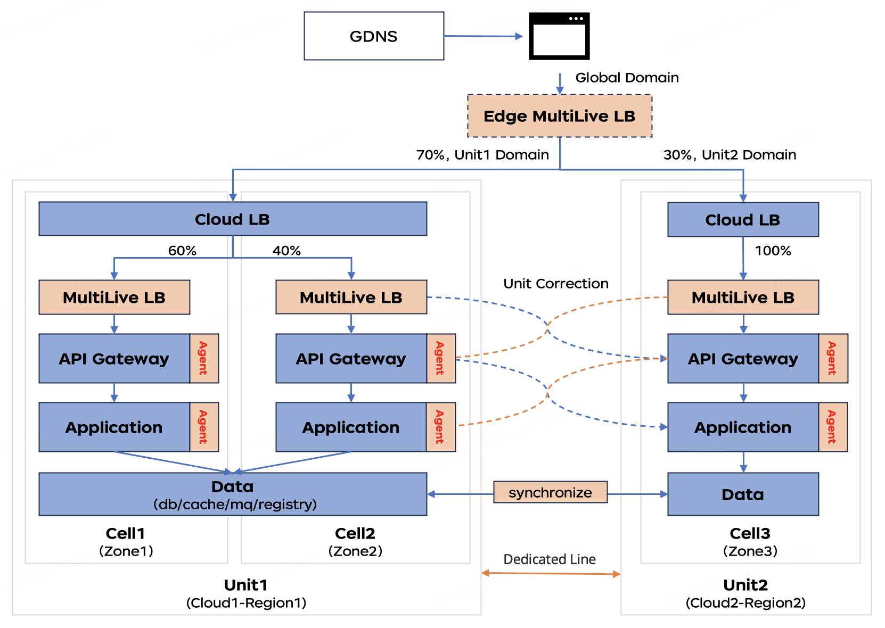
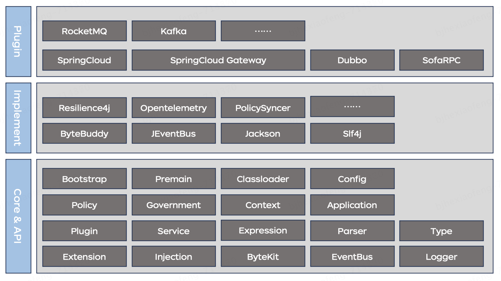
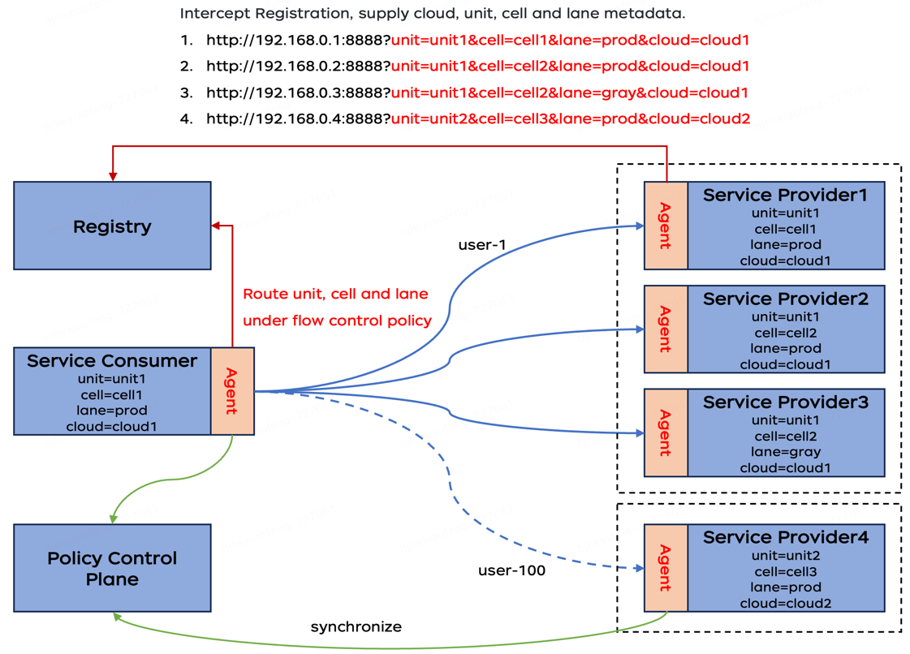
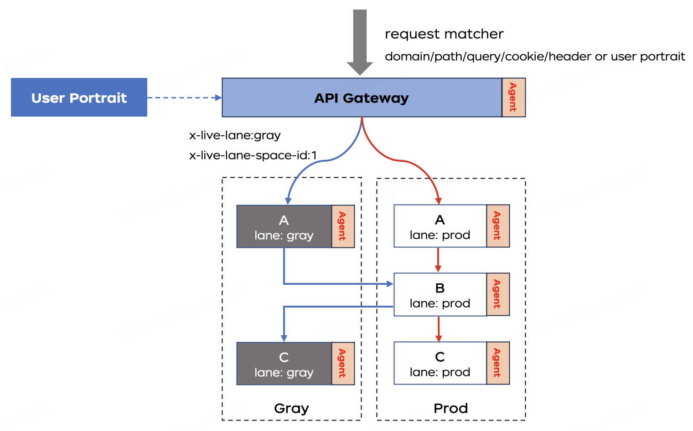
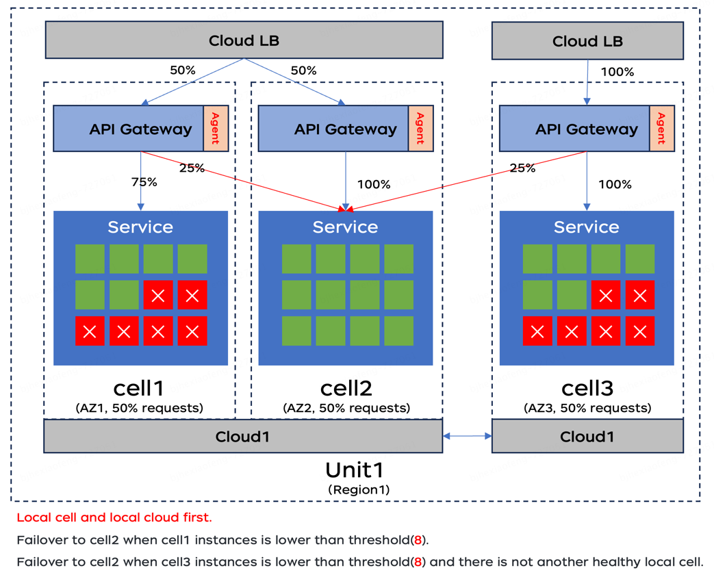

# joylive-agent

English | [简体中文](./README-zh.md)

## Overview

Microservice governance framework, leveraging bytecode enhancement technology, 
employs a micro-kernel extensible architecture's proxyless implementation, 
offering superior performance and resource efficiency compared to the sidecar pattern. 
In addition to supporting conventional microservice governance features such as circuit breaking, rate limiting, and degradation, 
it also facilitates swimlane governance and application multi-active traffic governance.
Offers traffic governance plugins for Spring cloud hoxton/2020/2021/2022/2023, Dubbo 2.6/2.7/3, SofaRpc, Rocketmq, and Kafka. 
This enables existing java applications within enterprises to seamlessly integrate traffic governance capabilities without altering business code,
supporting traffic scheduling in same-region, cross-region and multi-cloud multi-active scenarios, 
thereby enhancing business stability and disaster recovery capabilities.

## Architecture
1. Agent for multi-live   

2. Agent architect   

3. Agent government theory   

4. Agent for full chain gray release based on lane   

5. Agent for local cell priority strategy   

6. For more information, please refer to the [Architecture Manual](docs/architect.md).

## Related Projects

1. [joylive-injector](https://github.com/jd-opensource/joylive-injector), used for cloud-native scenario auto-injection of `joylive-agent`.

## How to use

### Requirements

Compile requirement: JDK 17+ and Maven 3.2.5+ 

Runtime requirement: JDK 8+

## Main Features

1. Supports traffic control for various models, including in-region multi-activity and cross-region multi-activity.
2. Support swimlane-based full-link gray scale, QPS and concurrent current limiting, label routing, load balancing and other microservice governance strategies;
3. Supports local cell priority and cross-cell fault-tolerance strategies.
4. Employs bytecode enhancement technology, which is non-intrusive to business code and minimally impacts business performance.
5. Adopts a microkernel architecture with strong class isolation, featuring an easy-to-use and simple extension and configuration system.

## Quick Start

View [Quick Start](./docs/quickstart.md)

## Configuration reference manual

View [Configuration Reference Manual](./docs/config.md)

## Usage Examples

View [Usage Examples](./docs/example.md)

## Q&A

View [Q&A](./docs/qa.md)

## Release History

View [Release History](./RELEASE.md)

## Roadmap

View [Roadmap](./docs/roadmap.md)
