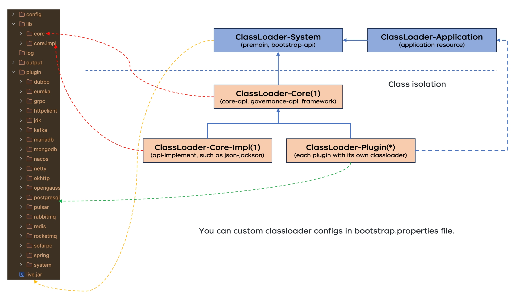

# joylive-agent

English | [简体中文](./README-zh.md)

## Overview

Java bytecode enhancement framework for traffic governance in multi-activity (unit) scenarios. Following the traditional sdk governance mode and sidecar governance mode, exploring the implementation of the new generation Proxyless mode based on microkernel extensible architecture, providing high performance, low resource consumption, and cost-effective traffic governance framework for enterprise Java ecosystem.

## Architecture
1. Agent for multi-Live   

2. Agent architect   

3. Agent government theory   

4. Agent for full chain gray release based on lane   

5. Agent for local cell priority strategy   

6. ClassLoader for isolation   

## How to use

### Requirements

Compile requirement: JDK 8+ and Maven 3.2.5+ 

## Main Features

1. Supports traffic control for various models, including in-region multi-activity and cross-region multi-activity.
2. Support swimlane-based full-link gray scale, QPS and concurrent current limiting, label routing, load balancing and other microservice governance strategies;
3. Supports local cell priority and cross-cell fault-tolerance strategies.
4. Employs bytecode enhancement technology, which is non-intrusive to business code and minimally impacts business performance.
5. Adopts a microkernel architecture with strong class isolation, featuring an easy-to-use and simple extension and configuration system.

## Quick Start

View [Quick Start](./docs/quickstart.md)

## Configuration reference manual

View [Configuration Reference Manual](./docs/config.md)

## Usage Examples

View [Usage Examples](./docs/example.md)

## Q&A

View [Q&A](./docs/qa.md)

## Release History

View [Release History](./RELEASE.md)