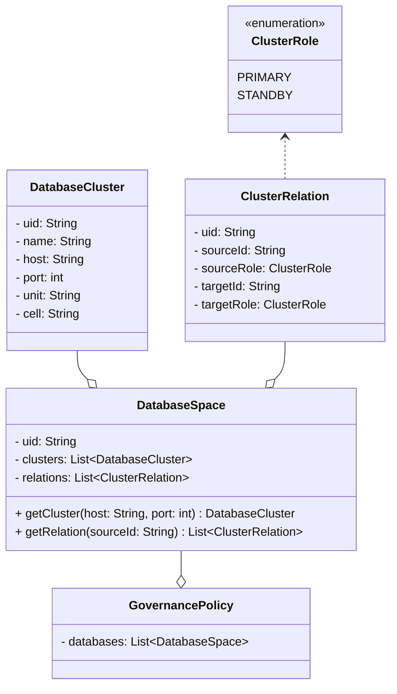
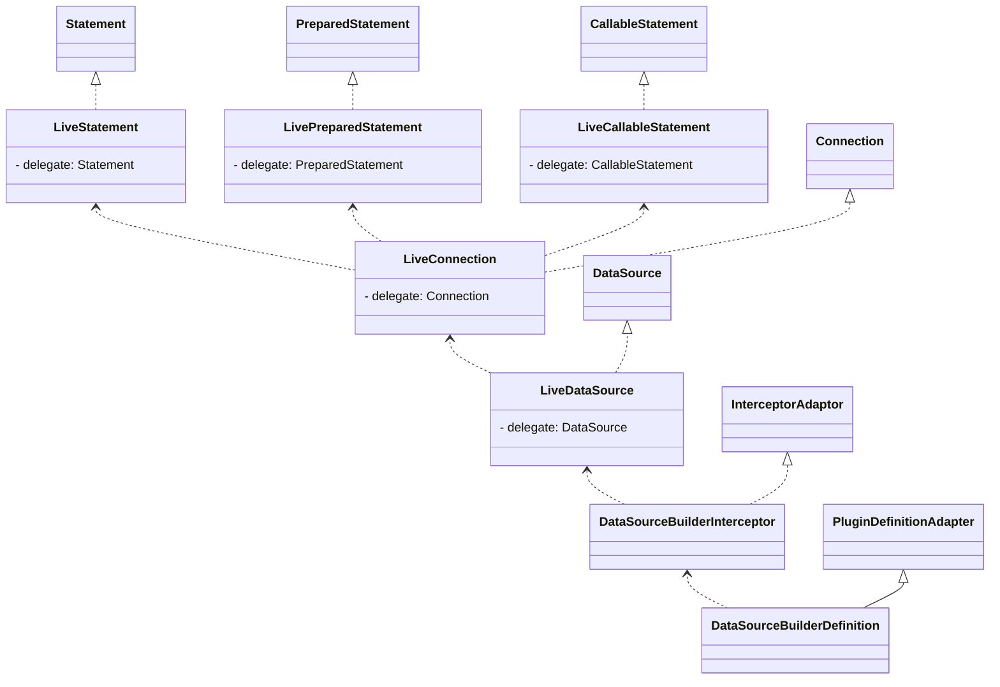

# 数据库切换

## 多活数据库

在多活空间中导入多活数据库，配置其关系和数据同步

## 数据库插件

拦截连接池，获取数据库，订阅数据库策略

### SpringBoot

DataSourceBuilder

DataSourceBuilderInterceptor拦截build方法，订阅数据库策略，构造LiveDataSource返回
在Statement中进行禁读禁写的判断

连接池实现

| 连接池  | 对象                  | 说明 |
|--------|-----------------------|----|
| druid  | DruidDataSource       |    |
| C3P0   | ComboPooledDataSource |    |
| Hikari | HikariDataSource      |    |
| DBCP   | BasicDataSource       |    |

## 数据库切换

1. 多活管控面切换相关数据库的关系及同步
2. 代理同步最新的数据库策略，触发数据库集群切换事件
3. 监听器订阅数据库集群切换事件，切换数据库集群