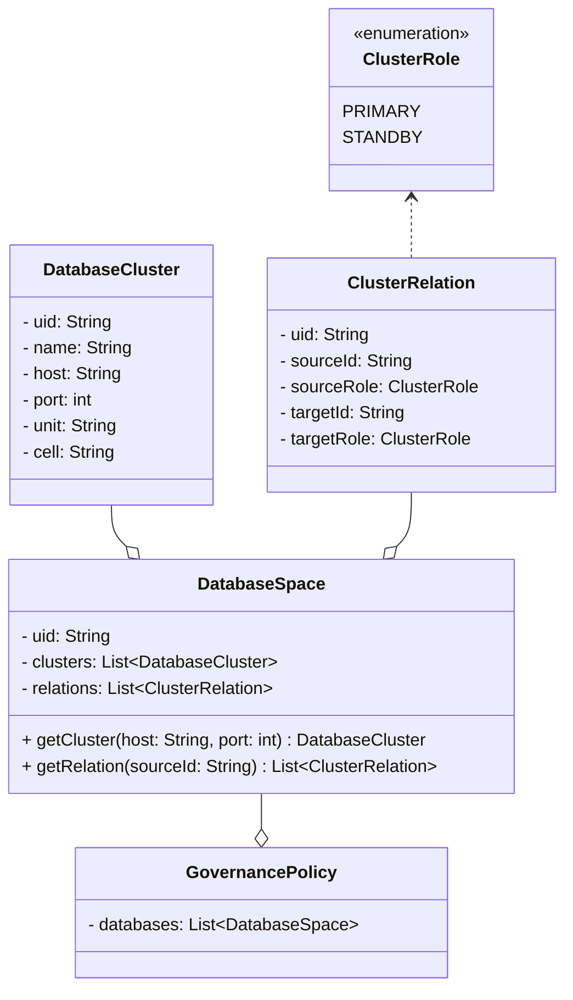
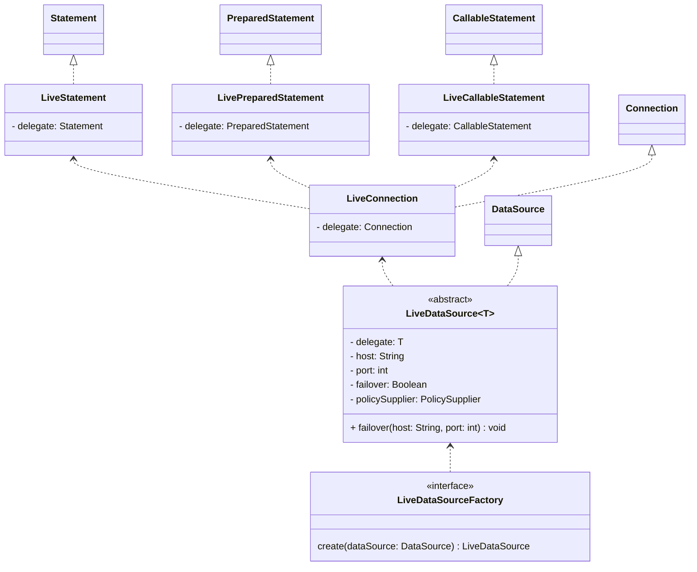
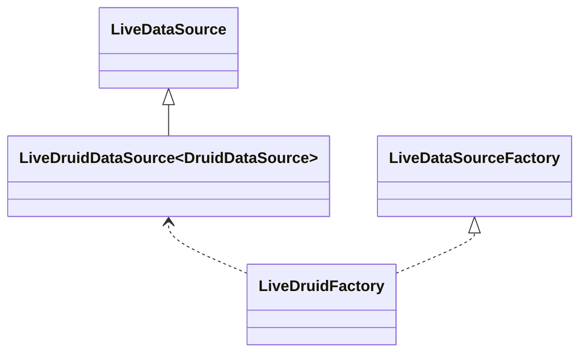
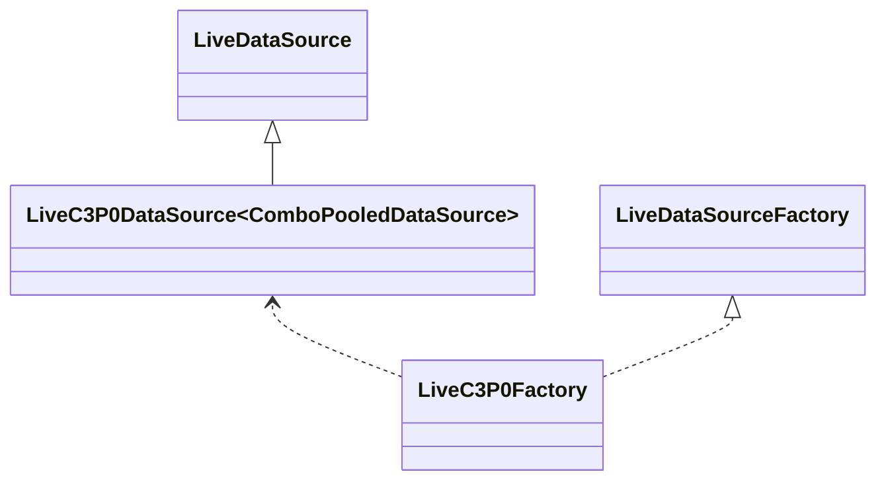
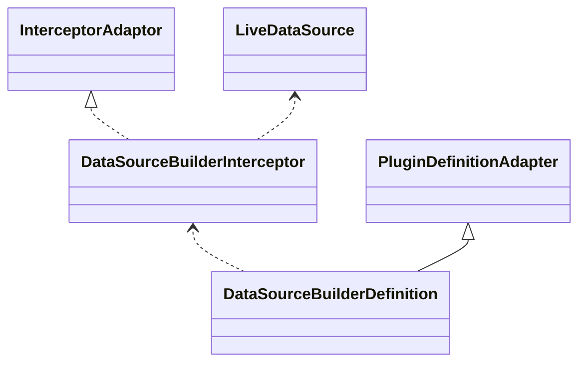

# 数据库切换

## 数据库多活策略

在多活空间中导入多活数据库，配置其关系和数据同步

## 多活数据源

多活数据源

### Druid

### C3P0

### Hikari

### DBCP

## 数据库插件

拦截连接池，获取数据库，订阅数据库策略

### SpringBoot

DataSourceBuilder

DataSourceBuilderInterceptor拦截build方法，订阅数据库策略，构造LiveDataSource返回
在Statement中进行禁读禁写的判断

## 数据库切换

### 切换开关

| 级别   | 配置项                                       | 说明                     |
|------|-------------------------------------------|------------------------|
| 集群级别 | live.failover                             | 在数据源URL上配置             |
| 应用级别 | agent.governance.database.defaultFailover | 在代理配置文件中设置，默认切换标识      |
| 应用级别 | agent.switch.database.enabled             | 在代理配置文件中设置，是否开启数据库切换增强 |

### 切换触发
1. 多活管控面切换相关数据库的关系及同步
2. 代理同步最新的数据库策略，触发数据库集群切换事件
3. 监听器订阅数据库集群切换事件，切换数据库集群