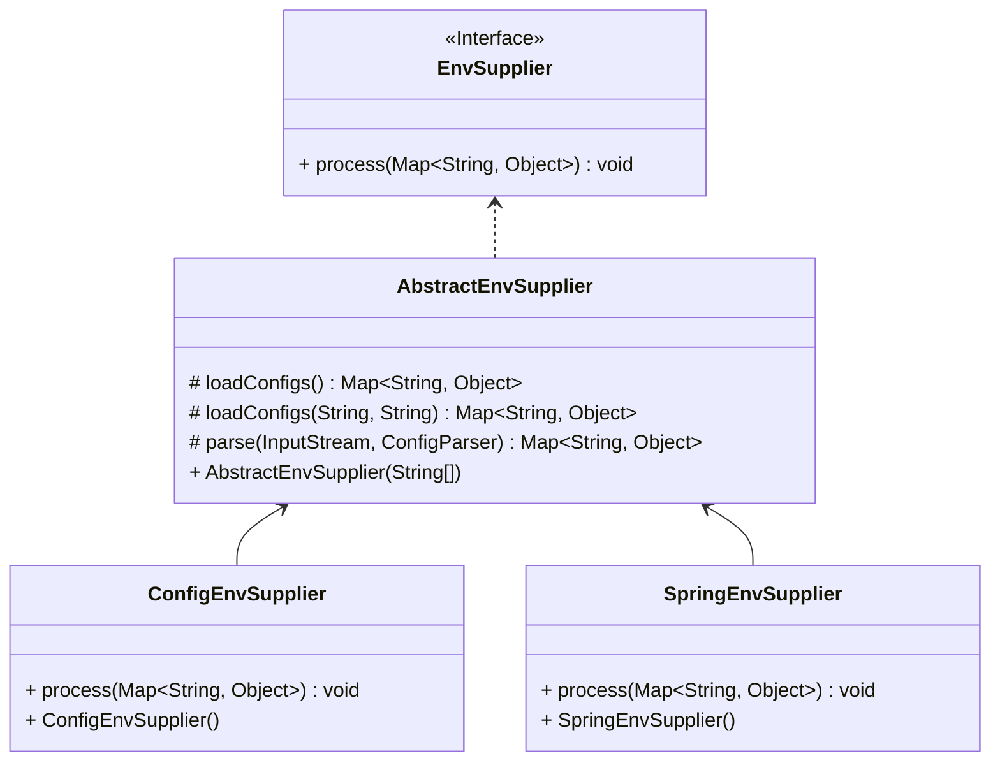

配置参考手册
===

## 1. 配置文件

### 1.1 配置文件目录

```bash
├── config
│   ├── bootstrap.properties
│   ├── config.yaml
│   ├── lanes.json
│   ├── livespaces.json
│   ├── logback.xml
│   └── microservice.json
```

| 文件 | 说明                    |
|----|-----------------------|
| bootstrap.properties   | 启动相关配置                |
| config.yaml   | 存放增强配置、插件定义以及多活流量治理策略配置 |
| logback.xml   | 日志配置                  |
| livespaces.json   | 本地多活策略                |
| lanes.json   | 本地泳道策略                |
| microservice.json   | 本地微服务策略               |

### 1.2 `bootstrap.properties`

存放应用信息和类加载器配置

```properties
app.name=${APPLICATION_NAME}
app.service.name=${APPLICATION_SERVICE_NAME:${APPLICATION_NAME}}
app.service.namespace=${APPLICATION_SERVICE_NAMESPACE}
app.service.group=${APPLICATION_SERVICE_GROUP}
app.service.gateway=${APPLICATION_SERVICE_GATEWAY:NONE}
app.service.port=${APPLICATION_SERVICE_PORT}
app.service.weight=${APPLICATION_SERVICE_WEIGHT:100}
app.service.warmupDuration=${APPLICATION_SERVICE_WARMUP_DURATION}
app.service.meta=${APPLICATION_SERVICE_META:}
app.location.cloud=${APPLICATION_LOCATION_CLOUD:}
app.location.region=${APPLICATION_LOCATION_REGION}
app.location.zone=${APPLICATION_LOCATION_ZONE}
app.location.cluster=${APPLICATION_LOCATION_CLUSTER}
app.location.liveSpaceId=${APPLICATION_LOCATION_LIVESPACE_ID:${CONFIG_LIVESPACE_ID}}
app.location.unitRuleId=${APPLICATION_LOCATION_UNIT_RULE_ID}
app.location.unit=${APPLICATION_LOCATION_UNIT}
app.location.cell=${APPLICATION_LOCATION_CELL:${NODE_CELL}}
app.location.laneSpaceId=${APPLICATION_LOCATION_LANESPACE_ID}
app.location.lane=${APPLICATION_LOCATION_LANE}
agent.enhance.shutdownOnError=${CONFIG_ENHANCE_SHUTDOWN_ON_ERROR:true}
agent.enhance.excludeApp=${CONFIG_ENHANCE_EXCLUDE_APPS:com.taobao.arthas.boot.Bootstrap,org.netbeans.Main,com.jdk.JDKVersionHelper,com.tongweb.srv.commons.utils.*}
classloader.core.configExtensions=yaml,yml,xml,json,properties
classloader.core.parentPrefixes=com.jd.live.agent.bootstrap.
classloader.core.selfPrefixes=com.jd.live.agent.core.
classloader.core.isolationPrefixes=META-INF/services/com.jd.live.agent
classloader.coreImpl.parentPrefixes=com.jd.live.agent.bootstrap.,com.jd.live.agent.core.,com.jd.live.agent.governance.
classloader.coreImpl.selfPrefixes=com.jd.live.agent.implement.,com.jd.live.agent.shaded.
classloader.plugin.parentPrefixes=com.jd.live.agent.bootstrap.,com.jd.live.agent.core.,com.jd.live.agent.governance.
classloader.plugin.selfPrefixes=com.jd.live.agent.plugin.
```

## 1.2 `config.yaml`

存放增强配置、插件定义以及多活流量治理策略配置。

其骨架如下：

```yaml
agent:
  enhance: # 存放字节码增强配置
  timer: # 存放定时任务配置
  publisher: # 存放事件总线配置
  plugin: # 插件配置
  sync: # 策略同步配置
  watchdog: # 文件变更监听配置
  switch: # 系统开关项
  governance: # 治理配置
  counter: # 流量统计配置
```

## 1.3 `livespaces.json`

请参阅[多活治理模型](./livespace.md)

## 1.4 `microservice.json`

请参阅[微服务治理模型](./governance.md)

## 1.5 `lanes.json`

请参阅[泳道模型](./lane.md)

## 2. 环境变量

配置文件`bootstrap.properties`和`config.yaml`的配置项的值支持环境变量占位符。支持的格式如下：
- `${KEY}`
- `${KEY:defaultValue}`
- `${KEY:${KEY2:defaultValue}}`

> 环境变量名称建议大写

### 2.1 环境变量来源

1. 系统环境变量

`System.getenv()`

2. 系统属性 

`System.getProperties()`

3. 应用资源文件 

应用类根路径下的`live-agent.properties`

4. 应用名称

spring应用名称，classpath下的`application.properties`、`application.yaml`或`application.yml`

5. 扩展实现环境提供者
```java
@Extensible
public interface EnvSupplier {
    
    void process(Map<String, Object> env);
    
}
```


1. `ConfigEnvSupplier`从应用资源路径加载`live-agent.properties`
2. `SpringEnvSupplier`从应用资源路径加载应用名称

### 2.2 常用环境变量

更多请参考`bootstrap.properties`和`config.yaml`中的配置

| 名称                                   | 说明          | 必需 | 默认值     | 说明                                                                                                        |
|--------------------------------------|-------------|-----|---------|-----------------------------------------------------------------------------------------------------------|
| APPLICATION_NAME                     | 应用名         | 是   |         | 建议和Spring的应用名称保持一致                                                                                        |
| APPLICATION_SERVICE_NAME             | 服务名         | 否   | 应用名称    | 建议和SpringCloud的应用名称保持一致                                                                                   |
| APPLICATION_LOCATION_LIVESPACE_ID    | 实例所在多活空间ID  | 是   |         |                                                                                                           |
| APPLICATION_LOCATION_UNIT            | 实例所在单元编码    | 是   |         |                                                                                                           |
| APPLICATION_LOCATION_CELL            | 实例所在分区编码    | 是   |         |                                                                                                           |
| APPLICATION_LOCATION_LANESPACE_ID    | 实例所在泳道空间ID  | 否   |         | 当启用泳道服务时候配置                                                                                               |
| APPLICATION_LOCATION_LANE            | 实例所在泳道编码    | 否   |         | 当启用泳道服务时候配置                                                                                               |
| APPLICATION_LOCATION_REGION          | 实例所在地域      | 否   |         |                                                                                                           |
| APPLICATION_LOCATION_ZONE            | 实例所在可用区     | 否   |         |                                                                                                           |
| CONFIG_LIVE_ENABLED                  | 启用多活流控      | 否   | false   | 是否要进行多活的流控                                                                                                |
| CONFIG_FLOW_CONTROL_ENABLED          | 启用服务流控      | 否   | true    | 启用服务流控，包括限流、熔断、负载均衡、标签路由等等策略                                                                              |
| CONFIG_LANE_ENABLED                  | 启用泳道流控      | 否   | false   | 启用泳道流控                                                                                                    |
| CONFIG_PROTECT_ENABLED               | 启用数据保护和主备切换 | 否   | false   |                                                                                                           |
| CONFIG_LIVE_MQ_ENABLED               | 启用MQ治理      | 否   | false   |                                                                                                           |
| CONFIG_CENTER_ENABLED                | 启用配置注入      | 否   | false   | 为spring应用注入动态配置                                                                                           |
| CONFIG_WARMUP_SERVICES               | 预热服务        | 否   |         | 配置预热的微服务名称，多个服务用分号或逗号分隔                                                                                   |
| CONFIG_REGISTRY_ENABLED              | 启用多注册和订阅    | 否   | false   |                                                                                                           |
| CONFIG_REGISTER_APP_SERVICE_ENABLED  | 启用应用服务注册    | 否   | false   |                                                                                                           |
| CONFIG_COUNTER_EXPORTER_TYPE         | 统计输出类型      | 否  | logging | <li>logging:日志</li><li>otlp.grpc:otlp grpc<li></li>otlp.http:otlp http</li><li>prometheus:prometheus</li> |
| CONFIG_COUNTER_EXPORTER_ENDPOINT     | 统计输出地址      | 否   |         | 当类型为配置otlp.grpc、otlp.http或prometheus时候需要配置目标地址                                                            |