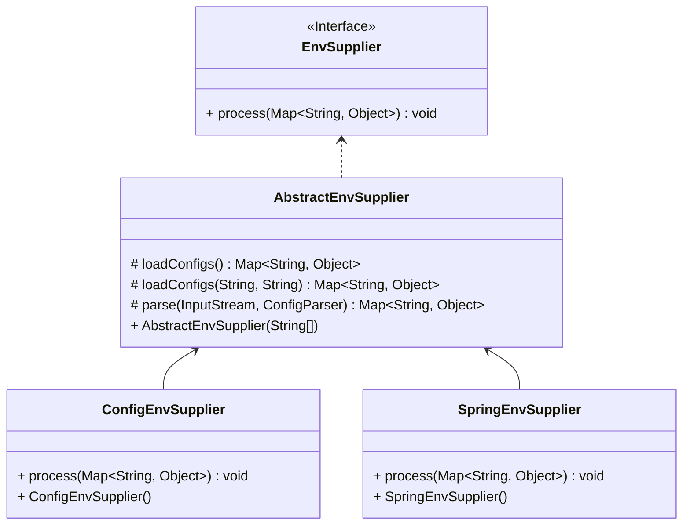

配置参考手册
===

## 1. 系统配置文件

## 1.1 bootstrap.properties

存放应用信息和类加载器配置

```properties
app.name=${APPLICATION_NAME}
app.service.name=${APPLICATION_SERVICE_NAME:${APPLICATION_NAME}}
app.service.gateway=${APPLICATION_SERVICE_GATEWAY:NONE}
app.location.region=${APPLICATION_LOCATION_REGION}
app.location.zone=${APPLICATION_LOCATION_ZONE}
app.location.liveSpaceId=${APPLICATION_LOCATION_LIVESPACE_ID:${CONFIG_LIVESPACE_ID}}
app.location.unit=${APPLICATION_LOCATION_UNIT}
app.location.cell=${APPLICATION_LOCATION_CELL}
app.location.laneSpaceId=${APPLICATION_LOCATION_LANESPACE_ID}
app.location.lane=${APPLICATION_LOCATION_LANE}
```

## 1.2 config.yaml

存放增强配置、插件定义以及多活流量治理策略配置

```yaml
agent: 
  switch:
    live:
      enabled: ${CONFIG_LIVE_ENABLED:true}
      dubbo: true
      sofarpc: true
```

## 2. 环境变量

配置文件支持环境变量占位符

### 2.1 环境变量来源
1. 系统环境变量

`System.getenv()`

2. 系统属性 

`System.getProperties()`

3. 应用资源文件 

`live-agent.properties`

4. 应用名称

`application.properties`、`application.yaml`或`application.yml`

5. 扩展实现环境提供者
```java
@Extensible
public interface EnvSupplier {
    
    void process(Map<String, Object> env);
    
}
```


1. `ConfigEnvSupplier`从应用资源路径加载`live-agent.properties`
2. `SpringEnvSupplier`从应用资源路径加载应用名称

### 2.2 常用环境变量

| 名称                              | 说明               | 必需 | 默认值    | 说明                                                     |
|-----------------------------------|--------------------|------|-----------|----------------------------------------------------------|
| APPLICATION_NAME                  | 应用名             | 是   |           | 建议和Spring的应用名称保持一致                           |
| APPLICATION_SERVICE_NAME          | 服务名             | 否   | 应用名称  | 建议和SpringCloud的应用名称保持一致                      |
| APPLICATION_LOCATION_LIVESPACE_ID | 实例所在多活空间ID | 是   |           |                                                          |
| APPLICATION_LOCATION_UNIT         | 实例所在单元编码   | 是   |           |                                                          |
| APPLICATION_LOCATION_CELL         | 实例所在分区编码   | 是   |           |                                                          |
| APPLICATION_LOCATION_LANESPACE_ID | 实例所在泳道空间ID | 否   |           | 当启用泳道服务时候配置                                   |
| APPLICATION_LOCATION_LANE         | 实例所在泳道编码   | 否   |           | 当启用泳道服务时候配置                                   |
| APPLICATION_LOCATION_REGION       | 实例所在地域       | 否   |           |                                                          |
| APPLICATION_LOCATION_ZONE         | 实例所在可用区     | 否   |           |                                                          |
| CONFIG_LIVE_ENABLED               | 启用多活流控       | 否   | true      | 是否要进行多活的流控                                     |
| CONFIG_POLICY_INITIALIZE_TIMEOUT  | 策略同步超时       | 否   | 10000(ms) |                                                          |
| CONFIG_FLOW_CONTROL_ENABLED       | 启用服务流控       | 否   | true      | 启用服务流控，包括限流、熔断、负载均衡、标签路由等等策略 |
| CONFIG_LANE_ENABLED               | 启用泳道流控       | 否   | true      | 启用泳道流控                                             |
| CONFIG_WARMUP_SERVICES            | 预热服务           | 否   |           | 配置预热的微服务名称，多个服务用分号或逗号分隔           |