服务治理
===

## 1. 服务注册

### 1.1 服务注册

在应用启动过程中，注册插件会拦截获取到消费者和服务提供者的初始化方法，会修改其元数据，增加多活和泳道的标签。

后续往注册中心注册的时候就会带有相关的标签了。

以下是Dubbo服务提供者注册样例

```java
@Injectable
@Extension(value = "ServiceConfigDefinition_v3", order = PluginDefinition.ORDER_REGISTRY)
@ConditionalOnProperties(value = {
        @ConditionalOnProperty(value = GovernanceConfig.CONFIG_LIVE_ENABLED, matchIfMissing = true),
        @ConditionalOnProperty(value = GovernanceConfig.CONFIG_LANE_ENABLED, matchIfMissing = true),
        @ConditionalOnProperty(value = GovernanceConfig.CONFIG_FLOW_CONTROL_ENABLED, matchIfMissing = true)
}, relation = ConditionalRelation.OR) @ConditionalOnClass(ServiceConfigDefinition.TYPE_CONSUMER_CONTEXT_FILTER)
@ConditionalOnClass(ServiceConfigDefinition.TYPE_SERVICE_CONFIG)
public class ServiceConfigDefinition extends PluginDefinitionAdapter {
    
    protected static final String TYPE_SERVICE_CONFIG = "org.apache.dubbo.config.ServiceConfig";

    private static final String METHOD_BUILD_ATTRIBUTES = "buildAttributes";

    private static final String[] ARGUMENT_BUILD_ATTRIBUTES = new String[]{
            "org.apache.dubbo.config.ProtocolConfig"
    };

    // ......

    public ServiceConfigDefinition() {
        this.matcher = () -> MatcherBuilder.named(TYPE_SERVICE_CONFIG);
        this.interceptors = new InterceptorDefinition[]{
                new InterceptorDefinitionAdapter(
                        MatcherBuilder.named(METHOD_BUILD_ATTRIBUTES).
                                and(MatcherBuilder.arguments(ARGUMENT_BUILD_ATTRIBUTES)),
                        () -> new ServiceConfigInterceptor(application, policySupplier))
        };
    }
}
```

```java
public class ServiceConfigInterceptor extends InterceptorAdaptor {

    // ......
    
    @Override
    public void onSuccess(ExecutableContext ctx) {
        MethodContext methodContext = (MethodContext) ctx;

        Map<String, String> map = (Map<String, String>) methodContext.getResult();
        application.label(map::putIfAbsent);

        // ......
    }
}
```

### 1.2 服务订阅

1. 服务注册过程中，获取到服务会订阅其相关的治理策略
```java
public class ServiceConfigInterceptor extends InterceptorAdaptor {

    // ......
    
    @Override
    public void onSuccess(ExecutableContext ctx) {
        MethodContext methodContext = (MethodContext) ctx;

        // ......

        AbstractInterfaceConfig config = (AbstractInterfaceConfig) ctx.getTarget();
        ApplicationConfig application = config.getApplication();
        String registerMode = application.getRegisterMode();
        if (DEFAULT_REGISTER_MODE_INSTANCE.equals(registerMode)) {
            policySupplier.subscribe(application.getName());
        } else if (DEFAULT_REGISTER_MODE_INTERFACE.equals(registerMode)) {
            policySupplier.subscribe(config.getInterface());
        } else {
            policySupplier.subscribe(application.getName());
            policySupplier.subscribe(config.getInterface());
        }
    }
}
```
2. 代理的微服务配置中，可以配置预热的服务名称，在代理启动过程中会提前订阅相关的治理策略。

```java
@Injectable
@Extension(value = "PolicyManager", order = InjectSourceSupplier.ORDER_POLICY_MANAGER)
public class PolicyManager implements PolicySupervisor, InjectSourceSupplier, ExtensionInitializer, InvocationContext {

    // ......
    
    @Override
    public void initialize() {
        systemPublisher.addHandler(events -> {
            for (Event<AgentEvent> event : events) {
                if (event.getData().getType() == EventType.AGENT_SERVICE_READY) {
                    // subscribe after all services are started.
                    policyServices = computePolicyServices();
                    warmup();
                }
            }
        });
    }

    private void warmup() {
        if (warmup.compareAndSet(false, true)) {
            ServiceConfig serviceConfig = governanceConfig == null ? null : governanceConfig.getServiceConfig();
            Set<String> warmups = serviceConfig == null ? null : serviceConfig.getWarmups();
            warmups = warmups == null ? new HashSet<>() : warmups;
            AppService service = application.getService();
            String namespace = service == null ? null : service.getNamespace();
            String name = service == null || service.getName() == null ? null : service.getName();
            if (name != null) {
                warmups.add(name);
            }
            if (!warmups.isEmpty()) {
                warmups.forEach(o -> subscribe(new PolicySubscriber(o, namespace, PolicyType.SERVICE_POLICY, policyServices)));
            }
        }
    }

}
```

### 1.3 优雅启动

1. 拦截注册中心事件，把注册放到延迟队列
```java
@Injectable
@Extension(value = "RegistryDefinition_v3", order = PluginDefinition.ORDER_REGISTRY)
@ConditionalOnProperties(value = {
        @ConditionalOnProperty(value = GovernanceConfig.CONFIG_LIVE_ENABLED, matchIfMissing = true),
        @ConditionalOnProperty(value = GovernanceConfig.CONFIG_LANE_ENABLED, matchIfMissing = true),
        @ConditionalOnProperty(value = GovernanceConfig.CONFIG_FLOW_CONTROL_ENABLED, matchIfMissing = true)
}, relation = ConditionalRelation.OR)
@ConditionalOnClass(ServiceConfigDefinition.TYPE_CONSUMER_CONTEXT_FILTER)
@ConditionalOnClass(RegistryDefinition.TYPE_SERVICE_DISCOVERY)
public class RegistryDefinition extends PluginDefinitionAdapter {

    protected static final String TYPE_SERVICE_DISCOVERY = "org.apache.dubbo.registry.client.AbstractServiceDiscovery";

    private static final String METHOD_REGISTER = "doRegister";

    private static final String[] ARGUMENT_REGISTER = new String[]{
            "org.apache.dubbo.registry.client.ServiceInstance"
    };

    // ......

    public RegistryDefinition() {
        this.matcher = () -> MatcherBuilder.isSubTypeOf(TYPE_SERVICE_DISCOVERY);
        this.interceptors = new InterceptorDefinition[]{
                new InterceptorDefinitionAdapter(
                        MatcherBuilder.named(METHOD_REGISTER)
                                .and(MatcherBuilder.arguments(ARGUMENT_REGISTER))
                                .and(MatcherBuilder.not(MatcherBuilder.isAbstract())),
                        () -> new RegistryInterceptor(application, lifecycle, registry))
        };
    }
}
```
```java
public abstract class AbstractRegistryInterceptor extends InterceptorAdaptor {

    // ......

    @Override
    public void onEnter(ExecutableContext ctx) {
        MethodContext mc = (MethodContext) ctx;
        if (application.getStatus() == AppStatus.STARTING) {
            ServiceInstance instance = getInstance(mc);
            if (instance != null) {
                logger.info("Delay registration until application is ready, service=" + instance.getService());
                lifecycle.addReadyHook(() -> {
                    logger.info("Register when application is ready, service=" + instance.getService());
                    registry.register(instance);
                    return mc.invoke();
                }, ctx.getType().getClassLoader());
                mc.setSkip(true);
            }
        }
    }

    protected abstract ServiceInstance getInstance(MethodContext ctx);

}
```

```java
public class Bootstrap implements AgentLifecycle {
    
    // ......

    @Override
    public void addReadyHook(Callable<?> callable, ClassLoader classLoader) {
        if (callable != null) {
            readies.add(() -> {
                ClassLoader old = Thread.currentThread().getContextClassLoader();
                Thread.currentThread().setContextClassLoader(classLoader);
                try {
                    return callable.call();
                } finally {
                    Thread.currentThread().setContextClassLoader(old);
                }
            });
        }
    }
    
}
```
2. 拦截应用生命周期，在应用服务就绪前，同步等待订阅的服务策略就绪

```java
@Injectable
@Extension(value = "SpringApplicationDefinition_v5", order = PluginDefinition.ORDER_APPLICATION)
@ConditionalOnClass(SpringApplicationDefinition.TYPE_SPRING_APPLICATION_RUN_LISTENERS)
@ConditionalOnProperties(value = {
        @ConditionalOnProperty(value = GovernanceConfig.CONFIG_LIVE_ENABLED, matchIfMissing = true),
        @ConditionalOnProperty(value = GovernanceConfig.CONFIG_LANE_ENABLED, matchIfMissing = true),
        @ConditionalOnProperty(value = GovernanceConfig.CONFIG_FLOW_CONTROL_ENABLED, matchIfMissing = true)
}, relation = ConditionalRelation.OR)
public class SpringApplicationDefinition extends PluginDefinitionAdapter {

    protected static final String TYPE_SPRING_APPLICATION_RUN_LISTENERS = "org.springframework.boot.SpringApplicationRunListeners";

    private static final String METHOD_STARTED = "started";

    private static final String METHOD_READY = "ready";

    private static final String METHOD_RUNNING = "running";

    // ......

    public SpringApplicationDefinition() {
        this.matcher = () -> MatcherBuilder.named(TYPE_SPRING_APPLICATION_RUN_LISTENERS);
        this.interceptors = new InterceptorDefinition[]{
                new InterceptorDefinitionAdapter(MatcherBuilder.named(METHOD_STARTED),
                        () -> new ApplicationStartedInterceptor(policySupervisor, publisher)),
                new InterceptorDefinitionAdapter(MatcherBuilder.in(METHOD_READY, METHOD_RUNNING),
                        () -> new ApplicationReadyInterceptor(publisher))
        };
    }
}
```

```java
public class ApplicationStartedInterceptor extends InterceptorAdaptor {

    // ......

    @Override
    public void onEnter(ExecutableContext ctx) {
        publisher.offer(AgentEvent.onApplicationStarted("Application is started"));
        policySupervisor.waitReady();
    }
}
```

```java
public class ApplicationReadyInterceptor extends InterceptorAdaptor {

    // ......

    @Override
    public void onEnter(ExecutableContext ctx) {
        publisher.offer(AgentEvent.onApplicationReady("Application is ready"));
    }
}
```
3. 在流控相关插件里面，会对进入的请求进行判断，如果代理还没有就绪则拒绝

```java
@Injectable
@Extension(value = "ReadyInboundFilter", order = InboundFilter.ORDER_INBOUND_LIVE_UNIT)
@ConditionalOnProperty(value = GovernanceConfig.CONFIG_LIVE_ENABLED, matchIfMissing = true)
public class ReadyInboundFilter implements InboundFilter {

    // ......

    @Override
    public <T extends InboundRequest> void filter(InboundInvocation<T> invocation, InboundFilterChain chain) {
        if (!application.getStatus().inbound()) {
            invocation.publish(publisher, TrafficEvent.builder().actionType(ActionType.REJECT).requests(1));
            invocation.reject(FaultType.UNREADY, "Service instance is not ready,"
                    + " service=" + application.getService().getName()
                    + " address=" + Ipv4.getLocalIp());
        }
    }
}
```
4. 服务策略同步完成，在代理就绪的时候，再次进行注册。

```java
public class Bootstrap implements AgentLifecycle {

    // ......
    
    private void onAgentEvent(AgentEvent event) {
        switch (event.getType()) {
            case APPLICATION_READY:
                onReady();
                application.setStatus(AppStatus.READY);
                break;
            // ......
        }
    }

    private void onReady() {
        // Some framework does not support multi thread to registration
        for (Callable<?> runnable : readies) {
            try {
                runnable.call();
            } catch (Throwable e) {
                Throwable cause = e instanceof InvocationTargetException ? e.getCause() : null;
                cause = cause != null ? cause : e;
                onException(cause.getMessage(), cause);
            }
            readies.clear();
        }
    }
}
```

5. 确保消费者拿到地址后，后端服务已经就绪

### 1.4 优雅停机

1. 通过系统钩子，拦截到关闭事件，设置代理的状态为关闭
```java
public class Bootstrap implements AgentLifecycle {
    
    // ......

    public void install() {
        try {
            // ......
            shutdown = new Shutdown();
            shutdown.addHook(new ShutdownHookAdapter(() -> application.setStatus(AppStatus.DESTROYING), 0));
            shutdown.addHook(() -> serviceManager.stop());
            shutdown.register();
            publisher.offer(AgentEvent.onAgentReady("Success starting LiveAgent."));
        } catch (Throwable e) {
            // ......
        }
    }

}
```
2. 在流控相关插件里面，会对进入的请求进行判断，如果代理还没有就绪则拒绝
3. 确保关闭过程中，新进的请求不在处理。

## 2. 流量治理

2.1 请求

请求接口

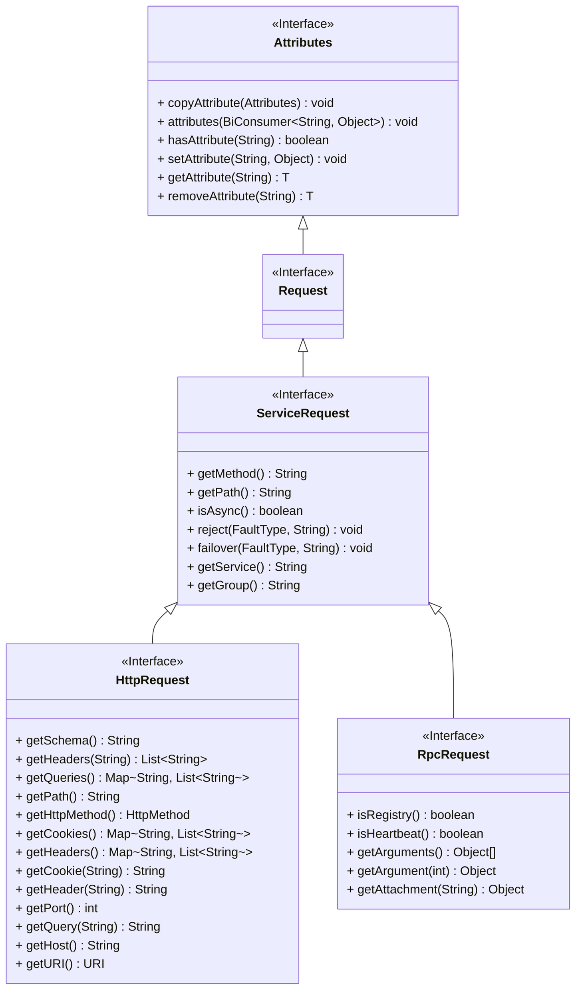

请求抽象实现

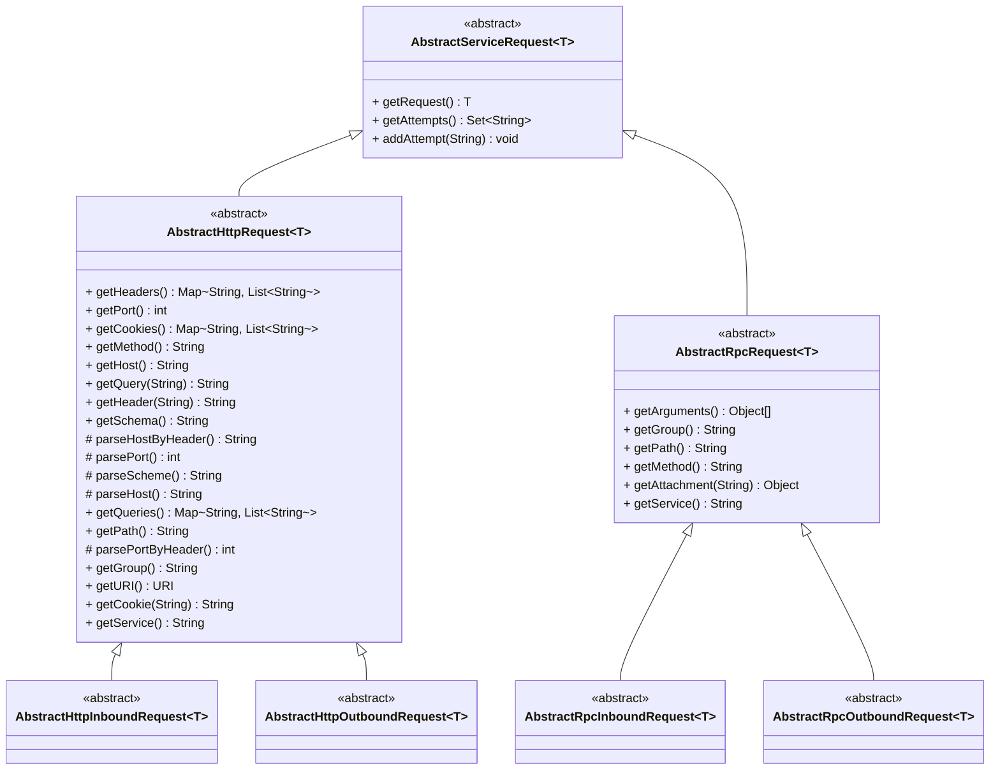
相关的路由插件里面需要实现这些抽象的请求对象，以Dubbo3为例

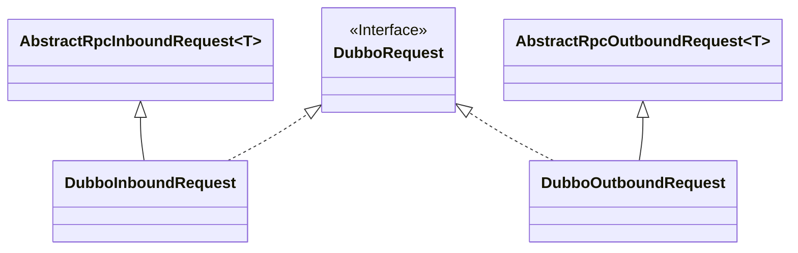

### 2.2 后端实例

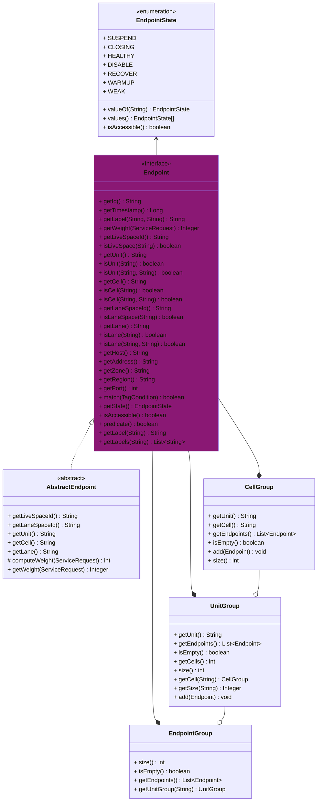

相关的路由插件里面需要实现这些抽象的请求对象，以Dubbo3为例

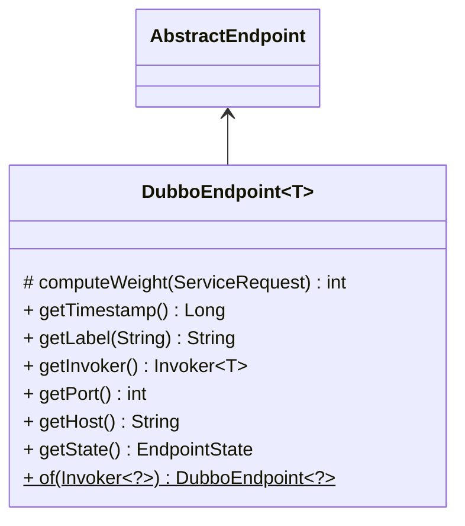

### 2.3 处理链

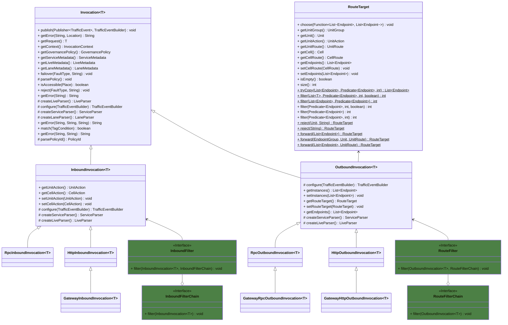

相关的路由插件里面需要实现调用对象，以Dubbo3为例

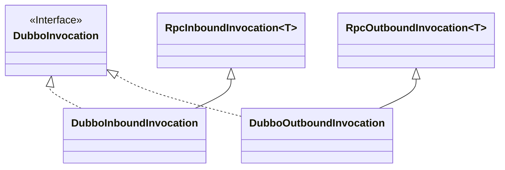

#### 2.3.1 元数据解析

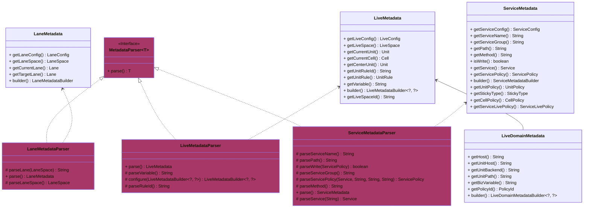

在调用对象构建的过程中会对请求进行元数据解析

```java
public abstract class Invocation<T extends ServiceRequest> implements Matcher<TagCondition> {
    
    // ......

    public Invocation(T request, InvocationContext context) {
        this.request = request;
        this.context = context;
        this.governancePolicy = context.getPolicySupplier().getPolicy();
        parsePolicy();
    }

    protected void parsePolicy() {
        ServiceParser serviceParser = createServiceParser();
        LiveParser liveParser = createLiveParser();
        MetadataParser<LaneMetadata> laneParser = createLaneParser();
        ServiceMetadata serviceMetadata = serviceParser.parse();
        LiveMetadata liveMetadata = liveParser.parse();
        this.serviceMetadata = serviceParser.configure(serviceMetadata, liveMetadata.getUnitRule());
        this.liveMetadata = liveParser.configure(liveMetadata, serviceMetadata.getServicePolicy());
        this.laneMetadata = laneParser.parse();
        this.policyId = parsePolicyId();
    }
    
    protected abstract LiveParser createLiveParser();
    
    protected abstract ServiceParser createServiceParser();
    
    protected LaneParser createLaneParser() {
        return new LaneMetadataParser(request, context.getGovernanceConfig().getLaneConfig(),
                context.getApplication(), governancePolicy);
    }
}
```

### 2.4 调用上下文

调用上下文存放了治理相关的配置，以及过滤器和策略提供者等等相关扩展实现。

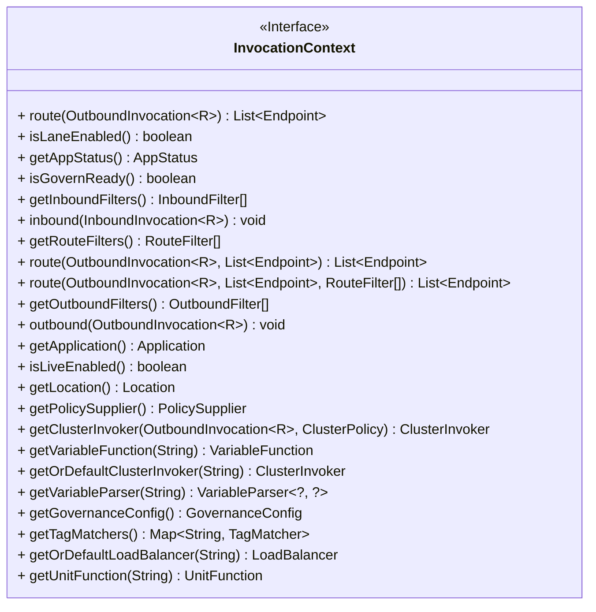

### 2.5 集群

用于在路由处理链中，实现集群策略，目前已经实现的集群策略如下

| 类型 | 名称     | 说明                 |
|----|--------|--------------------|
| failfast   | 快速失败(默认策略) | 调用失败，立即返回，抛出异常 |
| failover   | 故障容错   | 调用失败，根据重试策略容错      |
| failsafe   | 容忍失败   | 调用失败，立即返回成功        |


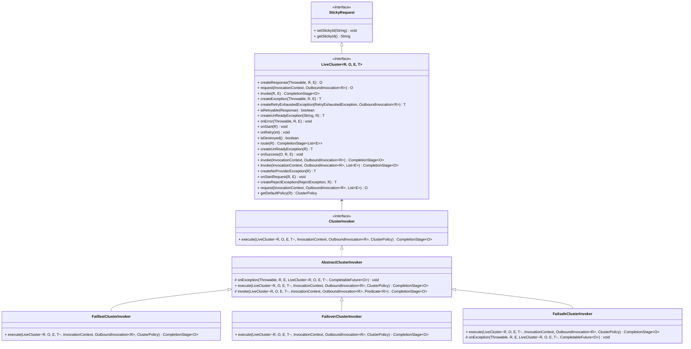

### 2.6 入流量

#### 2.6.1 拦截点

拦截相关框架的入流量处理链的入口或靠前的处理器。

以下是Dubbo3的拦截点

```java
@Injectable
@Extension(value = "ClassLoaderFilterDefinition_v3")
@ConditionalOnProperty(value = GovernanceConfig.CONFIG_LIVE_ENABLED, matchIfMissing = true)
@ConditionalOnProperty(value = GovernanceConfig.CONFIG_LIVE_DUBBO_ENABLED, matchIfMissing = true)
@ConditionalOnProperty(value = GovernanceConfig.CONFIG_REGISTRY_ENABLED, matchIfMissing = true)
@ConditionalOnProperty(value = GovernanceConfig.CONFIG_TRANSMISSION_ENABLED, matchIfMissing = true)
@ConditionalOnClass(ClassLoaderFilterDefinition.TYPE_CLASSLOADER_FILTER)
public class ClassLoaderFilterDefinition extends PluginDefinitionAdapter {

    protected static final String TYPE_CLASSLOADER_FILTER = "org.apache.dubbo.rpc.filter.ClassLoaderFilter";
    
    private static final String METHOD_INVOKE = "invoke";

    protected static final String[] ARGUMENT_INVOKE = new String[]{
            "org.apache.dubbo.rpc.Invoker",
            "org.apache.dubbo.rpc.Invocation"
    };

    // ......

    public ClassLoaderFilterDefinition() {
        this.matcher = () -> MatcherBuilder.named(TYPE_CLASSLOADER_FILTER);
        this.interceptors = new InterceptorDefinition[]{
                new InterceptorDefinitionAdapter(
                        MatcherBuilder.named(METHOD_INVOKE).
                                and(MatcherBuilder.arguments(ARGUMENT_INVOKE)),
                        () -> new ClassLoaderFilterInterceptor(context)
                )
        };
    }
}
```

```java
public class ClassLoaderFilterInterceptor extends InterceptorAdaptor {

    private final InvocationContext context;

    public ClassLoaderFilterInterceptor(InvocationContext context) {
        this.context = context;
    }
    
    @Override
    public void onEnter(ExecutableContext ctx) {
        MethodContext mc = (MethodContext) ctx;
        Object[] arguments = mc.getArguments();
        Invocation invocation = (Invocation) arguments[1];
        try {
            context.inbound(new DubboInboundInvocation(new DubboInboundRequest(invocation), context));
        } catch (RejectException e) {
            Result result = new AppResponse(new RpcException(RpcException.FORBIDDEN_EXCEPTION, e.getMessage()));
            mc.setResult(result);
            mc.setSkip(true);
        }
    }
}
```

```java
public interface InvocationContext {

    // ......
    
    default <R extends InboundRequest> void inbound(InboundInvocation<R> invocation) {
        InboundFilterChain.Chain chain = new InboundFilterChain.Chain(getInboundFilters());
        chain.filter(invocation);
    }
    
}
```

#### 2.6.2 过滤链

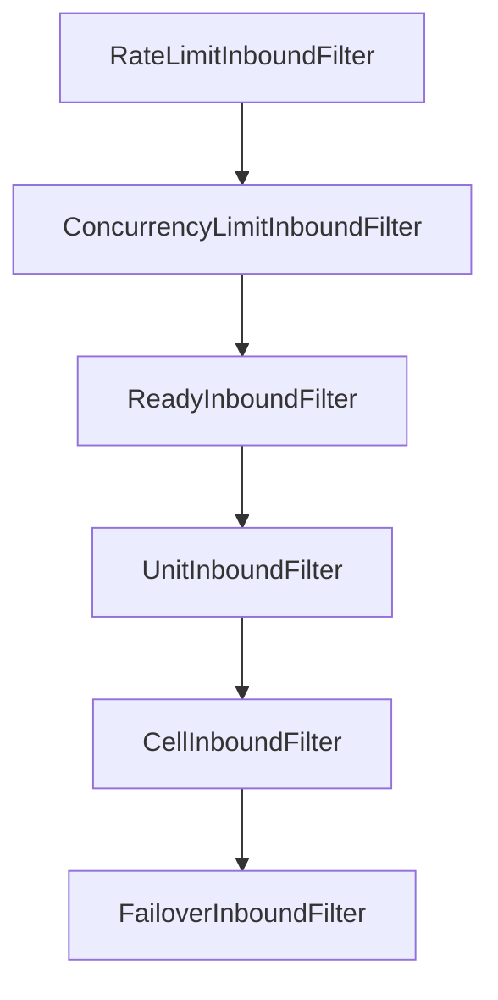

| 过滤器 | 名称      | 说明                          |
|-----|---------|-----------------------------|
| RateLimitInboundFilter    | 限流过滤器   | 根据当前服务的限流策略来进行限流            |
| ConcurrencyLimitInboundFilter    | 并发过滤器   | 根据当前服务的并发策略来进行限流            |
| ReadyInboundFilter    | 治理就绪过滤器 | 判断治理状态，只有就绪状态才能进入流量         |
| UnitInboundFilter    | 单元过滤器   | 判断当前请求是否匹配当前单元，以及当前单元是否可以访问 |
| CellInboundFilter    | 分区过滤器   | 判断当前分区是否可以访问                |
| FailoverInboundFilter    | 纠错过滤器   | 目前对错误流量只实现了拒绝               |


### 2.7 出流量

#### 2.7.1 拦截点

1. 如果只开启了多活或泳道治理，则只需对后端实例进行过滤，可以拦截负载均衡或服务实例提供者相关方法

```java
@Injectable
@Extension(value = "LoadBalanceDefinition_v2.7")
@ConditionalOnProperties(value = {
        @ConditionalOnProperty(name = {
                GovernanceConfig.CONFIG_LIVE_ENABLED,
                GovernanceConfig.CONFIG_LANE_ENABLED
        }, matchIfMissing = true, relation = ConditionalRelation.OR),
        @ConditionalOnProperty(name = GovernanceConfig.CONFIG_FLOW_CONTROL_ENABLED, value = "false"),
        @ConditionalOnProperty(name = GovernanceConfig.CONFIG_LIVE_DUBBO_ENABLED, matchIfMissing = true)
}, relation = ConditionalRelation.AND)
@ConditionalOnClass(LoadBalanceDefinition.TYPE_ABSTRACT_CLUSTER)
@ConditionalOnClass(ClassLoaderFilterDefinition.TYPE_CONSUMER_CLASSLOADER_FILTER)
public class LoadBalanceDefinition extends PluginDefinitionAdapter {

    protected static final String TYPE_ABSTRACT_CLUSTER = "com.alibaba.dubbo.rpc.cluster.support.AbstractClusterInvoker";

    private static final String METHOD_SELECT = "select";

    private static final String[] ARGUMENT_SELECT = new String[]{
            "org.apache.dubbo.rpc.cluster.LoadBalance",
            "org.apache.dubbo.rpc.Invocation",
            "java.util.List",
            "java.util.List"
    };

    // ......

    public LoadBalanceDefinition() {
        this.matcher = () -> MatcherBuilder.isSubTypeOf(TYPE_ABSTRACT_CLUSTER)
                .and(MatcherBuilder.not(MatcherBuilder.isAbstract()));
        this.interceptors = new InterceptorDefinition[]{
                new InterceptorDefinitionAdapter(
                        MatcherBuilder.named(METHOD_SELECT)
                                .and(MatcherBuilder.arguments(ARGUMENT_SELECT)),
                        () -> new LoadBalanceInterceptor(context)
                )
        };
    }
}
```

拦截器里面调用上下文的路由方法

```java
public class LoadBalanceInterceptor extends InterceptorAdaptor {

    // ......

    @Override
    public void onEnter(ExecutableContext ctx) {
        MethodContext mc = (MethodContext) ctx;
        Object[] arguments = ctx.getArguments();
        List<Invoker<?>> invokers = (List<Invoker<?>>) arguments[2];
        List<Invoker<?>> invoked = (List<Invoker<?>>) arguments[3];
        DubboOutboundRequest request = new DubboOutboundRequest((Invocation) arguments[1]);
        DubboOutboundInvocation invocation = new DubboOutboundInvocation(request, context);
        DubboCluster3 cluster = clusters.computeIfAbsent((AbstractClusterInvoker<?>) ctx.getTarget(), DubboCluster3::new);
        try {
            List<DubboEndpoint<?>> instances = invokers.stream().map(DubboEndpoint::of).collect(Collectors.toList());
            if (invoked != null) {
                invoked.forEach(p -> request.addAttempt(new DubboEndpoint<>(p).getId()));
            }
            List<? extends Endpoint> endpoints = context.route(invocation, instances);
            if (endpoints != null && !endpoints.isEmpty()) {
                mc.setResult(((DubboEndpoint<?>) endpoints.get(0)).getInvoker());
            } else {
                mc.setThrowable(cluster.createNoProviderException(request));
            }
        } catch (RejectException e) {
            mc.setThrowable(cluster.createRejectException(e, request));
        }
        mc.setSkip(true);
    }

}
```

2. 如果开启了微服务治理，则设计到重试，需要对集群调用进行拦截

```java
@Injectable
@Extension(value = "ClusterDefinition_v2.7")
@ConditionalOnProperty(name = GovernanceConfig.CONFIG_FLOW_CONTROL_ENABLED, matchIfMissing = true)
@ConditionalOnProperty(name = GovernanceConfig.CONFIG_LIVE_DUBBO_ENABLED, matchIfMissing = true)
@ConditionalOnClass(ClusterDefinition.TYPE_ABSTRACT_CLUSTER)
@ConditionalOnClass(ClassLoaderFilterDefinition.TYPE_CONSUMER_CLASSLOADER_FILTER)
public class ClusterDefinition extends PluginDefinitionAdapter {

    protected static final String TYPE_ABSTRACT_CLUSTER = "org.apache.dubbo.rpc.cluster.support.AbstractClusterInvoker";

    private static final String METHOD_DO_INVOKE = "doInvoke";

    private static final String[] ARGUMENT_DO_INVOKE = new String[]{
            "org.apache.dubbo.rpc.Invocation",
            "java.util.List",
            "org.apache.dubbo.rpc.cluster.LoadBalance"
    };

    // ......

    public ClusterDefinition() {
        this.matcher = () -> MatcherBuilder.isSubTypeOf(TYPE_ABSTRACT_CLUSTER)
                .and(MatcherBuilder.not(MatcherBuilder.isAbstract()));
        this.interceptors = new InterceptorDefinition[]{
                new InterceptorDefinitionAdapter(
                        MatcherBuilder.named(METHOD_DO_INVOKE)
                                .and(MatcherBuilder.arguments(ARGUMENT_DO_INVOKE)),
                        () -> new ClusterInterceptor(context)
                )
        };
    }
}
```

拦截器里面构造集群对象进行同步或异步调用

```java
public class ClusterInterceptor extends InterceptorAdaptor {

    // ......
    
    @Override
    public void onEnter(ExecutableContext ctx) {
        MethodContext mc = (MethodContext) ctx;
        Object[] arguments = ctx.getArguments();
        DubboCluster3 cluster = clusters.computeIfAbsent((AbstractClusterInvoker<?>) ctx.getTarget(), DubboCluster3::new);
        List<Invoker<?>> invokers = (List<Invoker<?>>) arguments[1];
        List<DubboEndpoint<?>> instances = invokers.stream().map(DubboEndpoint::of).collect(Collectors.toList());
        DubboOutboundRequest request = new DubboOutboundRequest((Invocation) arguments[0]);
        DubboOutboundInvocation invocation = new DubboOutboundInvocation(request, context);
        DubboOutboundResponse response = cluster.request(context, invocation, instances);
        if (response.getThrowable() != null) {
            mc.setThrowable(response.getThrowable());
        } else {
            mc.setResult(response.getResponse());
        }
        mc.setSkip(true);
    }

}
```

#### 2.7.2 过滤链

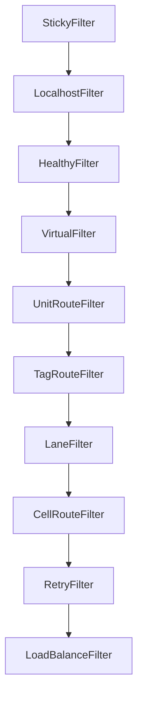

| 过滤器 | 名称      | 说明                             |
|-----|---------|--------------------------------|
| StickyFilter    | 粘连过滤器   | 根据服务的粘连策略进行过滤                  |
| LocalhostFilter    | 本机过滤器   | 本地开发调试插件                       |
| HealthyFilter    | 健康过滤器   | 根据后端实例的健康状态进行过滤                |
| VirtualFilter    | 虚拟节点过滤器 | 复制出指定数量的节点，用于开发测试              |
| UnitRouteFilter    | 单元路由过滤器 | 根据多活路由规则及微服务的多活策略，根据请求的目标单元进行过滤 |
| TagRouteFilter    | 标签路由过滤器 | 根据服务配置的标签路由策略进行过滤              |
| LaneFilter    | 泳道过滤器   | 根据泳道策略进行过滤            |
| CellRouteFilter    | 分区路由过滤器 | 根据多活路由规则及微服务的多活策略，根据请求的目标分区进行过滤 |
| RetryFilter    | 重试过滤器   | 尝试过滤掉已经重试过的节点                  |
| LoadBalanceFilter    | 负载均衡过滤器 | 根据服务配置的负载均衡策略进行路由              |

相关的策略请参考[多活治理模型](livespace.md)、[服务治理模型](governance.md)和[泳道模型](lane.md)