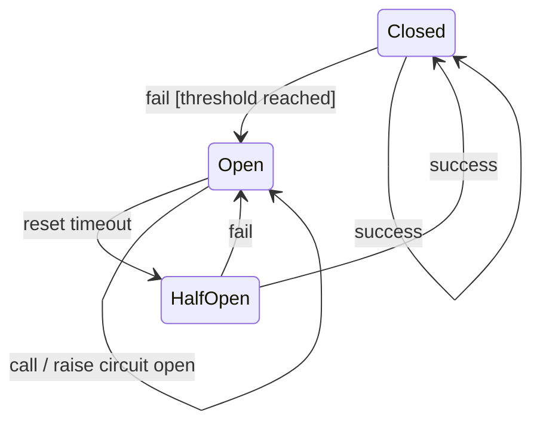

服务治理模型
===

## 1. 统一治理层级

统一HTTP和传统RPC的治理策略配置层级
```
.
└── 服务
    ├── 分组*
    │   ├── 路径*
    │   │   ├── 方法*

```
服务治理策略放在分组、路径和方法上，可以逐级设置，下级默认继承上级的配置

服务的默认策略设置到默认分组`default`上

| 类型        | 服务  | 分组 | 路径    | 方法     |
|-----------|-----|----|-------|--------|
| HTTP      | 域名  | 分组 | URL路径 | HTTP方法 |
| RPC 应用级注册 | 应用名 | 分组 | 接口名   | 方法名    |
| RPC 接口级注册 | 接口名 | 分组 | /     | 方法名    |

## 2. 服务策略
### 2.1 服务多活策略

| 元素       | 说明                         |
|----------|----------------------------|
| 写保护      | 是否写方法，需要在容灾切换的时候禁止写数据      |
| 变量表达式    | 单元化场景，可设置从方法参数获取路由变量       |
| 单元策略     | 非单元化、本单元优先、单元化和中心          |
| 默认单元容错阈值 | 本单元优先策略下，当单元指标小于该阈值可以跨单元访问 |
| 单元容错阈值   | 设置每个单元的容错阈值                |
| 分区策略     | 本分区优先、不限                   |
| 默认分区容错阈值 | 本分区优先策略下，当分区指标小于该阈值可以跨单元访问 |
| 分区容错阈值   | 设置每个分区的容错阈值                |

```json
{
  "writeProtect": false,
  "variableExpression": null,
  "unitPolicy": "PREFER_LOCAL_UNIT",
  "defaultUnitThreshold": 1,
  "unitRemotes": [
    {
      "name": "unit2",
      "type": "INSTANCES",
      "threshold": 1
    }
  ],
  "cellPolicy": "PREFER_LOCAL_CELL",
  "defaultCellThreshold": 3,
  "cellRemotes": [
    {
      "name": "cell1",
      "type": "INSTANCES",
      "threshold": 4
    }
  ]
}
```

### 2.2 服务泳道策略

| 元素     | 说明                                                                                                          |
|--------|-------------------------------------------------------------------------------------------------------------|
| 自动加入泳道 | 当应用部署到某个泳道后，是否自动加入该泳道路由。<br/>`true` 自动加入；<br/>`false` 不自动加入，按照配置的泳道策略生效；<br/>`null` 继承上级或泳道的配置项，泳道默认配置为自动加入 |
| 泳道空间   | 配置参与那些泳道空间及泳道路由                                                                                             |

```json
{
  "autoLaneEnabled": true,
  "lanePolicies": [
    {
      "laneSpaceId": "lane-space-1",
      "lanes": {
        "gray": "beta"
      }
    }
  ]
}
```
> 该策略描述自动加入泳道，在泳道空间`lane-space-1`中，把泳道`gray`的流量重定向到泳道`beta`

### 2.3 服务集群策略

| 元素   | 说明                                            |
|------|-----------------------------------------------|
| 类型   | 故障切换、快速失败、失败可容忍                               |
| 重试策略 | 当类型为故障切换，可配置重试策略，包括重视次数、重试时间间隔、超时时间、重试状态和重试异常 |

```json
{
  "clusterPolicy": {
    "type": "failover",
    "retryPolicy": {
      "retry": 10,
      "retryInterval": 1000,
      "timeout": 5000,
      "codePolicy": {
        "parser": "JsonPath",
        "expression": "$.code",
        "contentTypes": [
          "application/json"
        ]
      },
      "retryStatuses": [
        500,
        502
      ],
      "retryExceptions": [
        "java.lang.NullPointException"
      ]
    }
  }
}
```

### 2.4 服务负载均衡策略

| 元素 | 说明                                                         |
|----|------------------------------------------------------------|
| 类型 | 随机权重和轮询<br/>1. RANDOM 随机权重；<br/>2. ROUND_ROBIN 轮询          |
| 粘连 | 粘连策略<br/>1. NONE 不开启；<br/>2. PREFERRED 优先保存粘连节点；<br/>3. FIXED 固定粘连节点 |

```json
{
  "loadBalancePolicy": {
    "policyType": "ROUND_ROBIN",
    "stickyType": "NONE"
  }
}
```

### 2.5 服务限流策略

| 元素     | 说明                                    |
|--------|---------------------------------------|
| 名称     | 限流策略名称                                |
| 类型     | 限流实现类型，包括`Resilience4j`和`TokenBucket` |
| 滑动窗口   | 配置滑动窗口信息，包括调用次数和时间窗                   |
| 最大等待时间 | 最大等待时间                                |
| 参数     | 限流操作需要的参数                             |
| 条件     | 限流开启的条件                               |

```json
{
  "rateLimitPolicies": [
    {
      "name": "limit-rule-1",
      "version": 1704038400000,
      "realizeType": "Resilience4j",
      "slidingWindows": [
        {
          "threshold": 1,
          "timeWindowInMs": 1000
        },
        {
          "threshold": 3,
          "timeWindowInMs": 2000
        }
      ],
      "maxWaitMs": 100,
      "actionParameters": {
      },
      "relationType": "AND",
      "conditions": [
        {
          "type": "header",
          "opType": "EQUAL",
          "key": "x-live-ext-demo",
          "value": [
            "abc"
          ]
        }
      ]
    }
  ]
}
```

### 2.6 服务并发控制策略

| 元素    | 说明                      |
|-------|-------------------------|
| 名称    | 并发控制策略名称                |
| 类型    | 限流实现类型，包括`Resilience4j` |
| 最大并发数 | 最大并发数                   |
| 最大等待时间 | 最大等待时间                                |
| 参数     | 限流操作需要的参数                             |
| 条件     | 限流开启的条件                               |

```json
{
  "concurrencyLimitPolicies": [
    {
      "name": "limit-rule-2",
      "version": 1704038400000,
      "realizeType": "Resilience4j",
      "maxConcurrency": 10,
      "maxWaitMs": 100,
      "actionParameters": {
      },
      "relationType": "AND",
      "conditions": [
        {
          "type": "header",
          "opType": "EQUAL",
          "key": "x-live-ext-demo",
          "value": [
            "abc"
          ]
        }
      ]
    }
  ]
}
```

### 2.7 服务标签路由策略

| 元素 | 说明                          |
|----|-----------------------------|
| 名称 | 策略名称                        |
| 规则 | 定义多个规则，每个规则包括开启条件、目标权重和目标标签 |

```json
{
  "routePolicies": [
    {
      "name": "route1",
      "tagRules": [
        {
          "order": 5,
          "relationType": "AND",
          "conditions": [
            {
              "opType": "EQUAL",
              "type": "header",
              "key": "x-live-unit",
              "values": [
                "unit1"
              ]
            }
          ],
          "destinations": [
            {
              "weight": 100,
              "relationType": "AND",
              "conditions": [
                {
                  "opType": "EQUAL",
                  "key": "unit",
                  "values": [
                    "unit1"
                  ]
                }
              ]
            }
          ]
        }
      ]
    }
  ]
}
```

### 2.8 服务熔断降级策略



| 元素       | 说明                                    |
|----------|---------------------------------------|
| 名称       | 策略名称                                  |
| 级别       | SERVICE：服务级别；API：API级别；INSTANCE：实例级别  |
| 滑动窗口类型   | 指定滑动窗口的类型，count：次数；time：时间            |
| 滑动窗口大小   | 指定滑动窗口的大小，如果是count，则为调用次数，如果是time，则为秒 |
| 最小调用次数   | 保护阈值，防止调用次数过小的应用因为偶发故障产生熔断            |
| 错误码策略    | 用于从应答体中提取错误码                          |
| 错误码      | 请求返回列表中的响应码之一，则会被熔断器所记录一次失败           |
| 熔断失败比率   | 触发熔断的失败次数比率阈值                         |
| 熔断慢调用比例  | 触发熔断的慢调用次数比率阈值                        |
| 慢调用界定阈值  | 调用耗时多长以上算是慢调用                         |
| 熔断时间     | 触发熔断时（状态为开启），多长时间内不允许授予访问令牌           |
| 半开状态调用次数 | 熔断器进入半开状态时，可以允许多少次尝试性访问               |
| 强制开启     | 强制开启熔断                                |
| 降级配置     | 熔断发生时，若进行降级配置，则会返回配置数据作为响应            |

```json
{
  "circuitBreakPolicies": [
    {
      "name": "cb1",
      "level": "SERVICE",
      "slidingWindowType": "count",
      "slidingWindowSize": 5,
      "minCallsThreshold": 1,
      "codePolicy": {
        "parser": "JsonPath",
        "expression": "$.code",
        "contentTypes": [
          "application/json"
        ]
      },
      "errorCodes": [
        "500",
        "502"
      ],
      "failureRateThreshold": 20,
      "slowCallRateThreshold": 20,
      "slowCallDurationThreshold": 1000,
      "waitDurationInOpenState": 50,
      "allowedCallsInHalfOpenState": 3,
      "forceOpen": false,
      "degradeConfig": {
        "responseCode": 200,
        "attributes": {
          "degrade-header-1": "degraded1",
          "degrade-header-2": "degraded2"
        },
        "responseBody": "Hello, your request has been downgraded."
      },
      "version": 1704038400000
    }
  ]
}
```

### 3. 服务策略完整骨架

下面以json格式展示了服务策略

```json
[
  {
    "name": "service-provider",
    "serviceType": "HTTP",
    "version": 0,
    "groups": [
      {
        "name": "default",
        "defaultGroup": true,
        "servicePolicy": {
          "livePolicy": {
          },
          "lanePolicies": [
          ],
          "clusterPolicy": {
          },
          "loadBalancePolicy": {
          },
          "rateLimitPolicies": [
          ],
          "concurrencyLimitPolicies": [
          ],
          "routePolicies": [
          ],
          "circuitBreakPolicies": [
          ]
        },
        "paths": [
          {
            "path": "/echo",
            "matchType": "EQUAL",
            "servicePolicy": {
            },
            "methods": [
              {
                "name": "GET",
                "servicePolicy": {
                }
              }
            ]
          }
        ]
      }
    ]
  }
]
```

