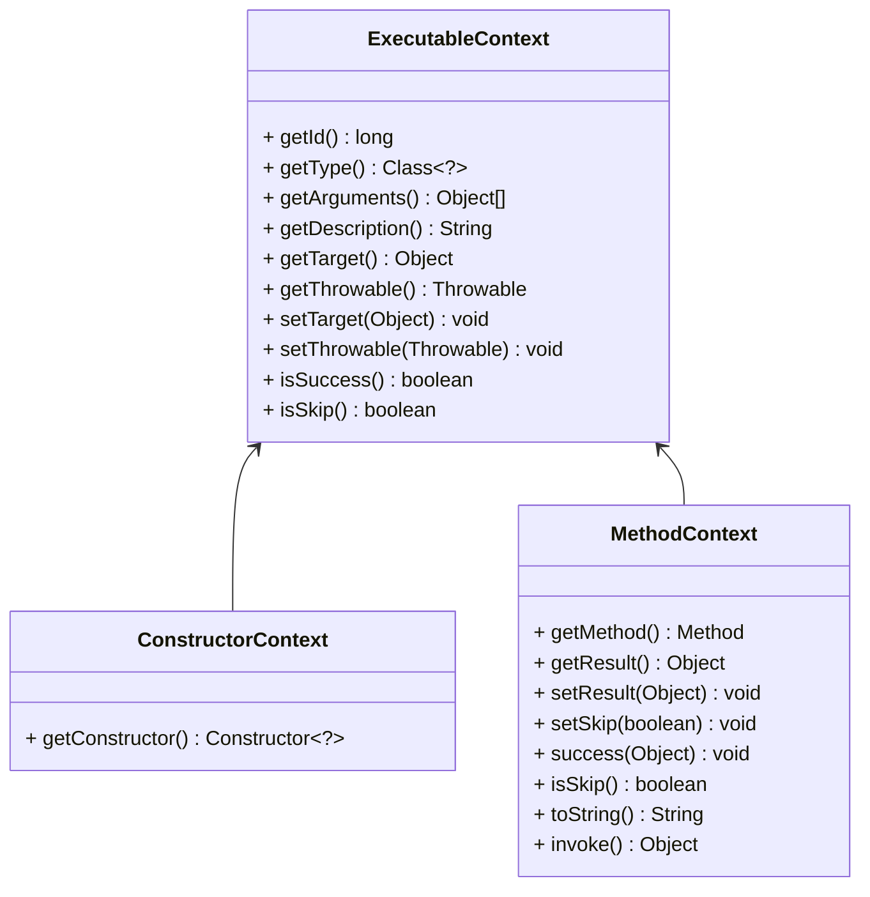

插件体系
===

插件是基于扩展实现的，有多个扩展组成，对某个框架进行特定增强，实现了多活流量治理等等业务逻辑。

一个插件打包成一个目录，如下图所示：

```
.
└── plugin
    ├── dubbo
    │   ├── joylive-registry-dubbo2.6-1.0.0.jar
    │   ├── joylive-registry-dubbo2.7-1.0.0.jar
    │   ├── joylive-registry-dubbo3-1.0.0.jar
    │   ├── joylive-router-dubbo2.6-1.0.0.jar
    │   ├── joylive-router-dubbo2.7-1.0.0.jar
    │   ├── joylive-router-dubbo3-1.0.0.jar
    │   ├── joylive-transmission-dubbo2.6-1.0.0.jar
    │   ├── joylive-transmission-dubbo2.7-1.0.0.jar
    │   └── joylive-transmission-dubbo3-1.0.0.jar
```
该dubbo插件，支持了3个版本，增强了注册中心，路由和链路透传的能力。

## 1. 插件扩展接口

### 1.1 插件定义接口

该接口描述了匹配的类型和提供了方法拦截器定义

```java
@Extensible("PluginDefinition")
public interface PluginDefinition {
    
    ElementMatcher<TypeDesc> getMatcher();
    
    InterceptorDefinition[] getInterceptors();
}
```

### 1.2 拦截器定义接口

该接口描述了匹配的方法及拦截器

```java
public interface InterceptorDefinition {
    
    ElementMatcher<MethodDesc> getMatcher();
    
    Interceptor getInterceptor();
}
```

### 1.3 拦截器接口

该接口描述了方法的拦截点

```java
public interface Interceptor {
    
    void onEnter(ExecutableContext ctx);

    void onSuccess(ExecutableContext ctx);

    void onError(ExecutableContext ctx);

    void onExit(ExecutableContext ctx);
}
```

### 1.4 上下文对象

`ExecutableContext`在拦截成员方法和构造函数的时候，分别有不同的实现`MethodContext`和`ConstructorContext`



## 2. 插件实现

以Dubbo3为例来看如何实现一个业务插件

### 2.1 插件的目录结构如下

```
.
├── com
│   └── jd
│       └── live
│           └── agent
│               └── plugin
│                   └── router
│                       └── dubbo
│                           └── v3
│                               ├── definition
│                               │   ├── ClassLoaderFilterDefinition.java
│                               │   ├── ClusterDefinition.java
│                               │   └── LoadBalanceDefinition.java
│                               ├── instance
│                               │   └── DubboEndpoint.java
│                               ├── interceptor
│                               │   ├── ClassLoaderFilterInterceptor.java
│                               │   ├── ClusterInterceptor.java
│                               │   └── LoadBalanceInterceptor.java
│                               ├── request
│                               │   ├── DubboRequest.java
│                               │   └── invoke
│                               │       └── DubboInvocation.java
│                               └── response
│                                   └── DubboResponse.java
└── org
    └── apache
        └── dubbo
            └── rpc
                └── cluster
                    └── support
                        └── DubboCluster3.java
```

1. `definition`用于存放插件定义
2. `interceptor`用于存放拦截器
3. `request`用于存放请求对象
4. `response`用于存放应答对象
5. `invoke`用于存放调用对象
6. `instance`用于存放后端实例对象
7. `DubboCluster3`集群对象放在了`org.apache.dubbo.rpc.cluster.support`下，方便访问受保护方法

### 2.2 Dubbo3集群插件定义

```java
@Injectable
@Extension(value = "ClusterDefinition_v2.7")
@ConditionalOnProperty(name = GovernanceConfig.CONFIG_FLOW_CONTROL_ENABLED, matchIfMissing = true)
@ConditionalOnProperty(name = GovernanceConfig.CONFIG_LIVE_DUBBO_ENABLED, matchIfMissing = true)
@ConditionalOnClass(ClusterDefinition.TYPE_ABSTRACT_CLUSTER)
@ConditionalOnClass(ClassLoaderFilterDefinition.TYPE_CONSUMER_CLASSLOADER_FILTER)
public class ClusterDefinition extends PluginDefinitionAdapter {

    protected static final String TYPE_ABSTRACT_CLUSTER = "org.apache.dubbo.rpc.cluster.support.AbstractClusterInvoker";

    private static final String METHOD_DO_INVOKE = "doInvoke";

    private static final String[] ARGUMENT_DO_INVOKE = new String[]{
            "org.apache.dubbo.rpc.Invocation",
            "java.util.List",
            "org.apache.dubbo.rpc.cluster.LoadBalance"
    };

    @Inject(InvocationContext.COMPONENT_INVOCATION_CONTEXT)
    private InvocationContext context;

    public ClusterDefinition() {
        this.matcher = () -> MatcherBuilder.isSubTypeOf(TYPE_ABSTRACT_CLUSTER)
                .and(MatcherBuilder.not(MatcherBuilder.isAbstract()));
        this.interceptors = new InterceptorDefinition[]{
                new InterceptorDefinitionAdapter(
                        MatcherBuilder.named(METHOD_DO_INVOKE)
                                .and(MatcherBuilder.arguments(ARGUMENT_DO_INVOKE)),
                        () -> new ClusterInterceptor(context)
                )
        };
    }
}
```
1. 插件定义从`PluginDefinitionAdapter`继承，实现了`PluginDefinition`接口
2. 插件声明了扩展实现`@Extension`
3. 插件声明了多个扩展启用条件，描述了启用了流控、启用了Dubbo和在Dubbo3的运行环境下才能开启
4. 插件注入了调用上下文`InvocationContext`，方便做多活流量控制
5. 插件在构造函数中，采用`MatcherBuilder`来描述需要拦截的类和方法

### 2.3 Dubbo3集群插件拦截器

```java
public class ClusterInterceptor extends InterceptorAdaptor {

    private final InvocationContext context;

    private final Map<AbstractClusterInvoker<?>, DubboCluster3> clusters = new ConcurrentHashMap<>();

    public ClusterInterceptor(InvocationContext context) {
        this.context = context;
    }
    
    @Override
    public void onEnter(ExecutableContext ctx) {
        MethodContext mc = (MethodContext) ctx;
        Object[] arguments = ctx.getArguments();
        DubboCluster3 cluster = clusters.computeIfAbsent((AbstractClusterInvoker<?>) ctx.getTarget(), DubboCluster3::new);
        List<Invoker<?>> invokers = (List<Invoker<?>>) arguments[1];
        List<DubboEndpoint<?>> instances = invokers.stream().map(DubboEndpoint::of).collect(Collectors.toList());
        DubboOutboundRequest request = new DubboOutboundRequest((Invocation) arguments[0]);
        DubboOutboundInvocation invocation = new DubboOutboundInvocation(request, context);
        DubboOutboundResponse response = cluster.request(context, invocation, instances);
        if (response.getThrowable() != null) {
            mc.setThrowable(response.getThrowable());
        } else {
            mc.setResult(response.getResponse());
        }
        mc.setSkip(true);
    }

}
```
1. 拦截器声明了在进入方法`onEnter`进行拦截
2. 通过上下文拿到调用的方法参数
3. 根据参数创建了集群对象、后端实例列表、请求对象和调用对象
4. 根据集群的策略同步调用获取应答
5. 根据调用接口设置了应答，并设置跳过了原方法的处理

