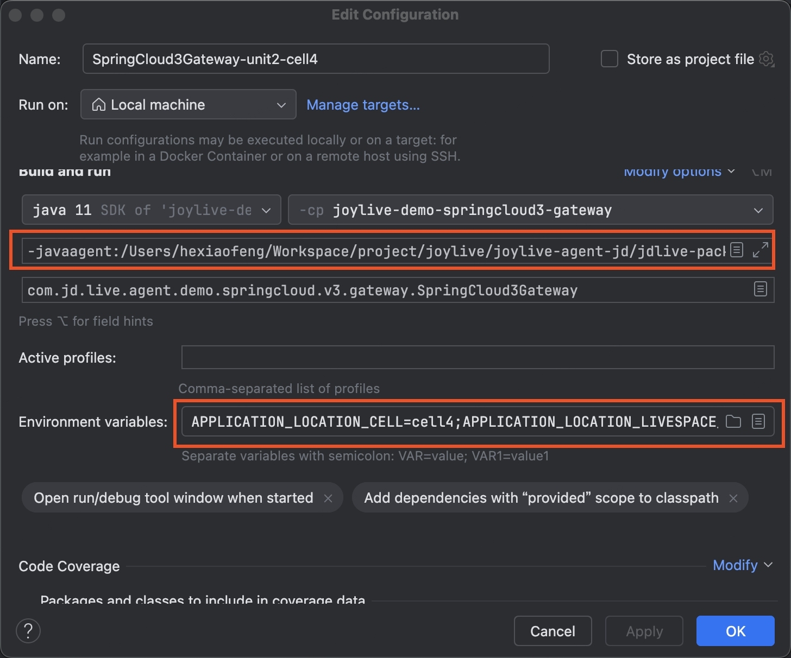

快速开始
===

## 1. 快速开始

### 1.1 获取Agent程序

#### 1.1.1 下载二进制包

从[Release](https://github.com/jd-opensource/joylive-agent/releases)中下载最新的二进制包

#### 1.1.2 手动编译

> 请提前准备好maven编译环境，项目根目录执行命令编译: 
> ```bash
> mvn package -f pom.xml -DskipTests=true
> ```

- **编译获取** JoyLive Agent Release包，路径：`joylive-package/target/live-x.x.x-SNAPSHOT`


### 1.2 获取Demo程序

编译`joylive-agent`，获取`joylive-demo/joylive-demo-springcloud3`下各项目的二进制包

- 网关

  `joylive-demo-springcloud3-gateway` Spring Cloud Gateway网关demo

- 应用

  `joylive-demo-springcloud3-provider` Spring Cloud应用demo

### 1.3 修改配置

JoyLive Agent包如下目录结构：

```bash
.
├── config
│   ├── bootstrap.properties
│   ├── config.yaml
│   ├── lanes.json
│   ├── livespaces.json
│   ├── logback.xml
│   └── microservice.json
├── lib
│   ├── core
│   │   ├── joylive-core-api-1.0.0.jar
│   │   ├── joylive-core-framework-1.0.0.jar
│   │   └── joylive-governance-api-1.0.0.jar
│   ├── core.impl
│   │   ├── joylive-bytekit-bytebuddy-1.0.0.jar
│   │   ├── joylive-command-lifecycle-1.0.0.jar
│   │   ├── joylive-event-logger-1.0.0.jar
│   │   ├── joylive-event-opentelemetry-1.0.0.jar
│   │   ├── ......
│   └── system
│       └── joylive-bootstrap-api-1.0.0.jar
├── live.jar
└── plugin
    ├── dubbo
    │   ├── joylive-registry-dubbo2.6-1.0.0.jar
    │   ├── joylive-registry-dubbo2.7-1.0.0.jar
    │   ├── joylive-registry-dubbo3-1.0.0.jar
    │   ├── joylive-router-dubbo2.6-1.0.0.jar
    │   ├── joylive-router-dubbo2.7-1.0.0.jar
    │   ├── ......
    ├── spring
    │   ├── joylive-application-springboot2-1.0.0.jar
    │   ├── joylive-registry-springcloud3-1.0.0.jar
    │   ├── ......
    └── ......
```

- 修改配置文件
  
`config`目录下为agent配置相关文件以及多活流量治理，微服务流量治理，泳道策略配置文件。

默认策略从本地文件加载，可以配置为远端加载

| 位置                    | 策略类型      |
| ----------------------- |-----------|
| agent.sync.liveSpace    | 多活流量策略    |
| agent.sync.microservice | 微服务流量治理策略 |
| agent.sync.laneSpace    | 泳道策略      |

策略配置项中`type`对应监听类型，file代表监听本地文件。

- 修改环境变量

常用的环境变量如下，更多请参阅[配置参考手册](./config.md)

| **名称**                          | **说明**           | **必需** | **默认值** | **说明**                                                 |
| --------------------------------- | ------------------ | -------- | ---------- | -------------------------------------------------------- |
| APPLICATION_NAME                  | 应用名             | 是       |            | 建议和Spring的应用名称保持一致                           |
| APPLICATION_SERVICE_NAME          | 服务名             | 否       | 应用名称   | 建议和SpringCloud的应用名称保持一致                      |
| APPLICATION_LOCATION_LIVESPACE_ID | 实例所在多活空间ID | 是       |            |                                                          |
| APPLICATION_LOCATION_UNIT         | 实例所在单元编码   | 是       |            |                                                          |
| APPLICATION_LOCATION_CELL         | 实例所在分区编码   | 是       |            |                                                          |
| APPLICATION_LOCATION_LANESPACE_ID | 实例所在泳道空间ID | 否       |            | 当启用泳道服务时候配置                                   |
| APPLICATION_LOCATION_LANE         | 实例所在泳道编码   | 否       |            | 当启用泳道服务时候配置                                   |
| APPLICATION_LOCATION_REGION       | 实例所在地域       | 否       |            |                                                          |
| APPLICATION_LOCATION_ZONE         | 实例所在可用区     | 否       |            |                                                          |
| CONFIG_LIVE_ENABLED               | 启用多活流控       | 否       | true       | 是否要进行多活的流控                                     |
| CONFIG_POLICY_INITIALIZE_TIMEOUT  | 策略同步超时       | 否       | 10000(ms)  |                                                          |
| CONFIG_FLOW_CONTROL_ENABLED       | 启用服务流控       | 否       | true       | 启用服务流控，包括限流、熔断、负载均衡、标签路由等等策略 |
| CONFIG_LANE_ENABLED               | 启用泳道流控       | 否       | true       | 启用泳道流控                                             |
| APPLICATION_SERVICE_GATEWAY       | 网关类型           | 否       | NONE       | 若为入口网关设置为FRONTEND，普通应用设置为NONE           |

注意：启动`joylive-demo-springcloud3-gateway` Spring Cloud Gateway网关demo时需设置为FRONTEND。启动`joylive-demo-springcloud3-provider` Spring Cloud应用demo则不需要设置，默认为NONE。

### 1.4 启动网关

本例子中采用非修改配置文件而是设置环境变量方式。

> 说明：
> - ${path_to_gateway_demo}为joylive-demo-springcloud3-gateway.jar所在路径；
> - ${path_to_agent}为joylive.jar所在路径。

模拟单元1内启动网关实例，命令如下：

```bash
# Linux or macOS设置环境变量
export APPLICATION_NAME=springcloud3-gateway
export APPLICATION_LOCATION_LIVESPACE_ID=v4bEh4kd6Jvu5QBX09qYq-qlbcs
export APPLICATION_LOCATION_UNIT=unit1
export APPLICATION_LOCATION_CELL=cell1
export APPLICATION_SERVICE_GATEWAY=FRONTEND
# 设置启动的nacos访问地址
export NACOS_ADDR=localhost:8848
export NACOS_USERNAME=nacos
export NACOS_PASSWORD=nacos
# 启动
java -javaagent:${path_to_agent}/live.jar -jar ${path_to_gateway_demo}/joylive-demo-springcloud3-gateway.jar 

# Windows设置环境变量（PowerShell）
$env:APPLICATION_NAME="springcloud3-gateway"
$env:APPLICATION_LOCATION_LIVESPACE_ID="v4bEh4kd6Jvu5QBX09qYq-qlbcs"
$env:APPLICATION_LOCATION_UNIT="unit1"
$env:APPLICATION_LOCATION_CELL="cell1"
$env:APPLICATION_SERVICE_GATEWAY="FRONTEND"
# 设置启动的nacos访问地址
$env:NACOS_ADDR="localhost:8848"
$env:NACOS_USERNAME="nacos"
$env:NACOS_PASSWORD="nacos"
# 启动
java -javaagent:${path_to_agent}\live.jar -jar ${path_to_gateway_demo}\joylive-demo-springcloud3-gateway.jar
```

### 1.5 启动应用

参考启动网关，模拟单元1内启动应用实例，命令如下：

```bash
# Linux or macOS设置环境变量
export APPLICATION_NAME=springcloud3-provider
export APPLICATION_LOCATION_LIVESPACE_ID=v4bEh4kd6Jvu5QBX09qYq-qlbcs
export APPLICATION_LOCATION_UNIT=unit1
export APPLICATION_LOCATION_CELL=cell1
# 设置启动的nacos访问地址
export NACOS_ADDR=localhost:8848
export NACOS_USERNAME=nacos
export NACOS_PASSWORD=nacos
# 启动
java -javaagent:${path_to_agent}/live.jar -jar ${path_to_provider_demo}/joylive-demo-springcloud3-provider.jar 

# Windows设置环境变量（PowerShell）
$env:APPLICATION_NAME="springcloud3-provider"
$env:APPLICATION_LOCATION_LIVESPACE_ID="v4bEh4kd6Jvu5QBX09qYq-qlbcs"
$env:APPLICATION_LOCATION_UNIT="unit1"
$env:APPLICATION_LOCATION_CELL="cell1"
# 设置启动的nacos访问地址
$env:NACOS_ADDR="localhost:8848"
$env:NACOS_USERNAME="nacos"
$env:NACOS_PASSWORD="nacos"
# 启动
java -javaagent:${path_to_agent}\live.jar -jar ${path_to_provider_demo}\joylive-demo-springcloud3-provider.jar
```

模拟单元2内启动应用实例，命令如下：

```bash
# Linux or macOS设置环境变量
export APPLICATION_NAME=springcloud3-provider
export APPLICATION_LOCATION_LIVESPACE_ID=v4bEh4kd6Jvu5QBX09qYq-qlbcs
export APPLICATION_LOCATION_UNIT=unit2
export APPLICATION_LOCATION_CELL=cell4
# 设置启动的nacos访问地址
export NACOS_ADDR=localhost:8848
export NACOS_USERNAME=nacos
export NACOS_PASSWORD=nacos
# 启动
java -javaagent:${path_to_agent}/live.jar -jar ${path_to_provider_demo}/joylive-demo-springcloud3-provider.jar 

# Windows设置环境变量（PowerShell）
$env:APPLICATION_NAME="springcloud3-provider"
$env:APPLICATION_LOCATION_LIVESPACE_ID="v4bEh4kd6Jvu5QBX09qYq-qlbcs"
$env:APPLICATION_LOCATION_UNIT="unit2"
$env:APPLICATION_LOCATION_CELL="cell4"
# 设置启动的nacos访问地址
$env:NACOS_ADDR="localhost:8848"
$env:NACOS_USERNAME="nacos"
$env:NACOS_PASSWORD="nacos"
# 启动
java -javaagent:${path_to_agent}\live.jar -jar ${path_to_provider_demo}\joylive-demo-springcloud3-provider.jar
```

### 1.6 验证注册

访问`nacos`注册中心，检查服务实例的元数据有如下数据代表agent增强成功。

```properties
x-live-space-id=v4bEh4kd6Jvu5QBX09qYq-qlbcs
x-live-unit=unit1
x-live-cell=cell1
```

### 1.7 流量测试

```bash
# 通过网关访问应用接口，指定单元变量unit1，指向访问unit1单元
curl -X GET "http://localhost:8888/service-provider/echo/abc?user=unit1" -H "Host:demo.live.local"

# 通过网关访问应用接口，指定单元变量unit2，指向访问unit2单元
curl -X GET "http://localhost:8888/service-provider/echo/abc?user=unit2" -H "Host:demo.live.local"
```

## 2. 调试

在IDE中进行调试，以IntelliJ Idea为例说明

### 2.1 编译工程

1. 对`joylive-agent`工程执行编译安装`mvn clean install`
2. 获取到`joylive-package`编译后的工程输出目录`target/live-${version}`的全路径

### 2.2 启动应用

#### 2.2.1 启动注册中心

准备并启动`Nacos`注册中心，获取其地址、用户和密码

#### 2.2.2 启动网关项目

运行网关应用 `joylive-demo-gateway`

配置参数和环境变量



虚拟机参数增加`-javeagent:live-${version}全路径`

配置环境变量参考如下

| 名称 | 值 | 说明                |
|----|---|-------------------|
| APPLICATION_LOCATION_CELL   | cell4  |  |
| APPLICATION_LOCATION_LIVESPACE_ID   | v4bEh4kd6Jvu5QBX09qYq-qlbcs  |                   |
| APPLICATION_LOCATION_UNIT   | unit2  |                   |
| APPLICATION_SERVICE_GATEWAY   | FRONTEND  |                   |
| CONFIG_LOCALHOST_ENABLED   | true  |                   |
| NACOS_ADDR   |   |                   |
| NACOS_NAMESPACE   | public  |                   |
| NACOS_PASSWORD   |   |                   |
| NACOS_USERNAME   |   |                   |

单元分区的配置参考`joylive-package工程的`的配置文件`livespaces.json`

#### 2.2.3 启动服务项目

运行微服务应用 `joylive-demo-provider`，参考网关应用的配置

配置环境变量参考如下

| 名称 | 值                           | 说明                |
|----|-----------------------------|-------------------|
| APPLICATION_LOCATION_CELL   | cell1                       |  |
| APPLICATION_LOCATION_LIVESPACE_ID   | v4bEh4kd6Jvu5QBX09qYq-qlbcs |                   |
| APPLICATION_LOCATION_UNIT   | unit1                       |                   |
| APPLICATION_SERVICE_GATEWAY   | FRONTEND                    |                   |
| CONFIG_LOCALHOST_ENABLED   | true                        |                   |
| NACOS_ADDR   |                             |                   |
| NACOS_NAMESPACE   | public                      |                   |
| NACOS_PASSWORD   |                             |                   |
| NACOS_USERNAME   |                             |                   |

### 2.3 访问请求

curl -X GET "http://localhost:8888/service-provider/echo/abc?user=unit1" -H "Host:demo.live.local"

## 3. 补充

### 3.1 Rocketmq

1. 准备好Rocketmq环境，启动好相关服务
2. 参考上述的应用配置，准备`joylive-demo-rocketmq`的运行环境。需要额外配置如下环境变量

| 变量 | 名词           | 说明                             |
|----|--------------|--------------------------------|
| CONFIG_LIVE_MQ_ENABLED   | 启用MQ标识       | 是否要启用MQ<li>true 启用</li><li>不启用 |
| CONFIG_LIVE_TOPICS   | 参与多活主题名称     | 多个主题用逗号分隔                      |
| ROCKETMQ_ADDR   | Rocketmq服务地址 | IP:端口                          |

3. 参考上述配置启动单元1的 `joylive-demo-springcloud3-gateway`
4. 参考上述配置启动单元1的 `joylive-demo-springcloud3-provider`
5. 参考上述配置启动单元1的 `joylive-demo-rocketmq`
6. 访问验证
```shell
curl -G 'demo.live.local:8888/service-rocketmq/echo/hello?user=unit1
```