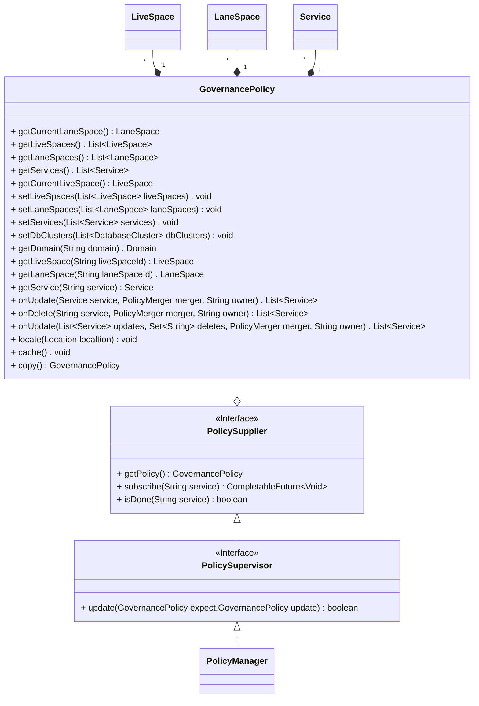
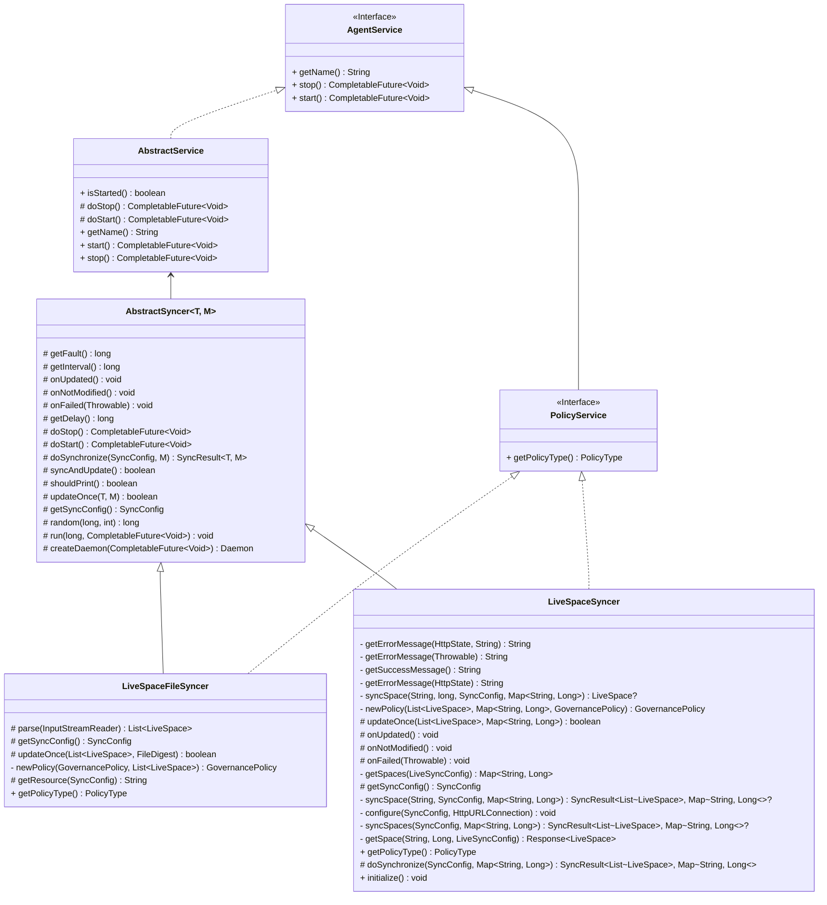

策略同步
===

## 1. 策略管理



- `PolicySupplier` 提供了获取最新治理策略的方法，并且可以订阅服务策略
- `PolicyManager` 是`PolicySupplier`的扩展实现，可以注入到需要的插件里面，更多注入细节请查阅[扩展体系](extension.md)
- `GovernancePolicy` 聚合了目前支持的治理策略，包括多活空间、泳道空间、微服务和数据库，微服务的策略可以来源于多个提供方。提供了服务策略更新合并的方法

## 2. 同步方式

系统内置了文件同步方式，及部分远程同步能力。可以在`config.yaml`中进行配置

```yaml
agent:
  sync:
    liveSpace:
      type: ${CONFIG_LIVE_SPACE_API_TYPE:file} # [file,multilive]
```



## 2.1 文件同步

系统内置了多活空间、泳道空间和微服务的策略文件，支持动态更新

同步类型默认是文件同步，配置`type`的值为`file`就开启文件同步

```
├── config
│   ├── lanes.json
│   ├── livespaces.json
│   └── microservice.json
```

## 2.2 控制面同步

系统内置了多活控制面的同步实现，可以参考实现微服务和泳道的同步实现

## 2.2.1 多活空间同步

配置文件样例如下：

```yaml
agent:
  sync:
    liveSpace:
      type: multilive
      url: http://api.live.local:9090/v1
      #spacesUrl: ${CONFIG_LIVE_SPACE_API_URL}/workspaces
      #spaceUrl: ${CONFIG_LIVE_SPACE_API_URL}/workspaces/${space_id}/version/${space_version}
      #serviceUrl: ${CONFIG_LIVE_SPACE_API_URL}/services/${service_name}/version/${service_version}
      service: true
      interval: 5000
      timeout: 3000
      initialTimeout: 20000
      delay: 0
      fault: 5000
      headers: 
        key1: value1
        key2: value2
```


| 属性             | 名称           | 说明                                           |
|----------------|--------------|----------------------------------------------|
| type           | 类型           | 配置为`multilive`                               |
| url            | 同步URL        |                                              |
| spacesUrl      | 同步空间的URL     | 可选，默认在url上增加子路径                              |
| serviceUrl     | 同步服务多活策略的URL | 可选，默认在url上增加子路径                              |
| service        | 同步微服务多活策略开关  | `true` 从多活管控面开启微服务多活策略同步<br/>`false` 关闭相应的同步 |
| interval       | 同步时间间隔       | 单位毫秒                                         |
| timeout        | 超时时间         | 请求超时时间                                       |
| initialTimeout | 初始化超时时间      | 单位毫秒                                         |
| delay          | 延迟同步初始化时间    | 单位毫秒                                         |
| fault          | 出错恢复同步时间     | 单位毫秒                                         |
| headers        | 请求头          | 可以存放密钥等额外需要的信息                               |
