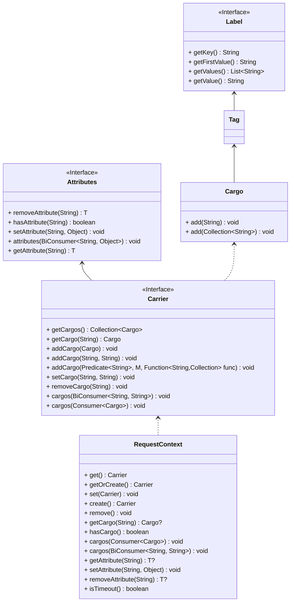
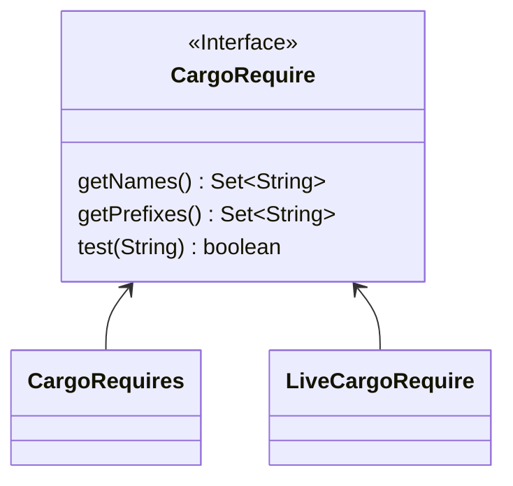
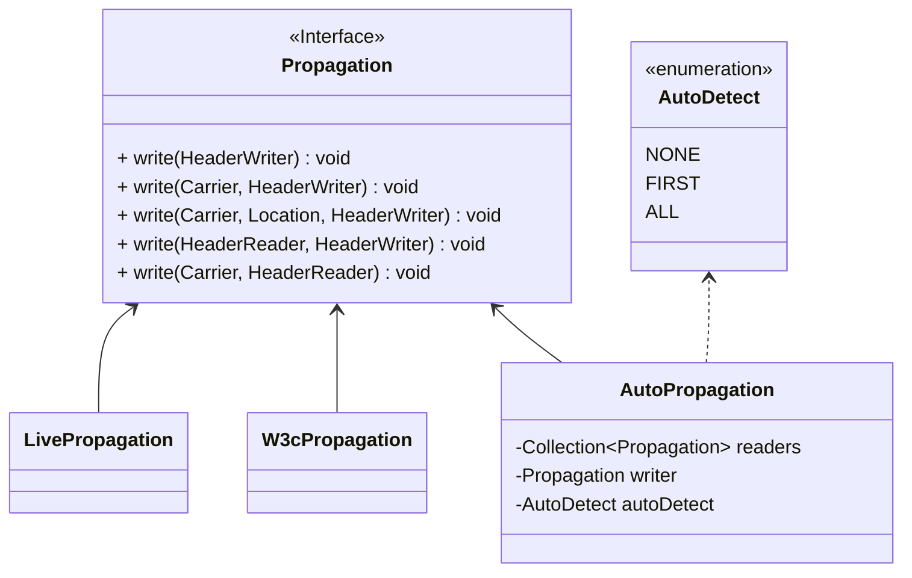

链路透传
===

在多活和泳道场景，需要透传多活的单元信息和泳道信息，让流量尽量闭环在单元或泳道内

## 1. 请求上下文

请求上下文`RequestContext`通过线程变量来携带信息`Carrier`


## 2. 定义需要透传的信息

基于扩展的方式来定义需还原到上下文的透传信息


1. `CargoRequire`定义需要透传的信息，并且描述为扩展接口
2. `LiveCargoRequire`是系统内置的多活透传定义实现
3. `CargoRequires`用于包装聚合所有的`CargoRequire`实现

| 键               | 说明         |
|-----------------|------------|
| x-live-space-id | 多活空间ID     |
| x-live-rule-id  | 多活空间路由ID   |
| x-live-uid      | 多活空间路由变量   |
| x-live-         | 多活前缀匹配     |
| x-lane-space-id | 泳道空间ID     |
| x-lane-code     | 泳道         |

## 3. 透传方式

支持多种透传方式，以扩展方式实现，默认是W3C透传，也保留老的Live透传



1. `W3cPropagation`按照W3C标准规范来进行透传
2. `LivePropagation`按照Live规范来进行透传, 一个Key对应一个Header
3. `AutoPropagation`用于自动探测透传方式

## 4. 透传实现

在服务调用方，拦截方法请求，把需要透传的上下文变量设置到传输对象里面。在服务提供方法，拦截请求处理，把透传的信息还原到上下文。

1. HTTP调用使用Header来传递
2. RPC调用使用Attachment来携带
3. MQ调用使用Attachment来携带

下面以Dubbo3为例来说明透传的实现

### 4.1 消费者

#### 4.1.1 消费者插件定义

```java
@Extension(value = "DubboConsumerDefinition_v3", order = PluginDefinition.ORDER_TRANSMISSION)
@Injectable
@ConditionalOnDubbo3TransmissionEnabled
@ConditionalOnClass(DubboConsumerDefinition.TYPE_ABSTRACT_CLUSTER_INVOKER)
public class DubboConsumerDefinition extends PluginDefinitionAdapter {

    public static final String TYPE_ABSTRACT_CLUSTER_INVOKER = "org.apache.dubbo.rpc.cluster.support.AbstractClusterInvoker";

    private static final String METHOD_INVOKE = "invoke";

    protected static final String[] ARGUMENT_INVOKE = new String[]{
            "org.apache.dubbo.rpc.Invocation"
    };

    @Inject(value = Propagation.COMPONENT_PROPAGATION, component = true)
    private Propagation propagation;

    public DubboConsumerDefinition() {

        this.matcher = () -> MatcherBuilder.isSubTypeOf(TYPE_ABSTRACT_CLUSTER_INVOKER);
        this.interceptors = new InterceptorDefinition[]{
                new InterceptorDefinitionAdapter(
                        MatcherBuilder.named(METHOD_INVOKE).
                                and(MatcherBuilder.arguments(ARGUMENT_INVOKE)),
                        () -> new DubboConsumerInterceptor(propagation))};
    }
}
```

该插件定义描述了拦截类型`org.apache.dubbo.rpc.cluster.filter.support.ConsumerContextFilter`的方法`invoke`

#### 4.1.1 消费者拦截器

```java
public class DubboConsumerInterceptor extends InterceptorAdaptor {

    private final Propagation propagation;

    public DubboConsumerInterceptor(Propagation propagation) {
        this.propagation = propagation;
    }

    @Override
    public void onEnter(ExecutableContext ctx) {
        RpcInvocation invocation = ctx.getArgument(0);
        Carrier carrier = RequestContext.getOrCreate();
        // read from rpc context by live propagation
        LIVE_PROPAGATION.read(carrier, new ObjectMapReader(RpcContext.getClientAttachment().getObjectAttachments()));
        // write to invocation with live attachments in rpc context
        propagation.write(carrier, new ObjectMapWriter(invocation.getObjectAttachments(), invocation::setAttachment));
        ServiceMetadata serviceMetadata = invocation.getServiceModel().getServiceMetadata();
        String provider = (String) serviceMetadata.getAttachments().get(PROVIDED_BY);
        if (provider != null && !provider.isEmpty()) {
            invocation.setAttachmentIfAbsent(REGISTRY_TYPE_KEY, SERVICE_REGISTRY_TYPE);
        }
    }
}
```

该拦截器在方法进入前，遍历所有`Cargo`对象，设置成为请求的附件，同时从请求里面还原应用程序设置的透传信息到上下文

### 4.2 服务提供者

#### 4.2.1 服务提供者插件定义

```java
@Injectable
@Extension(value = "DubboProviderDefinition_v3", order = PluginDefinition.ORDER_TRANSMISSION)
@ConditionalOnDubbo3TransmissionEnabled
@ConditionalOnClass(DubboProviderDefinition.TYPE_CONTEXT_FILTER)
public class DubboProviderDefinition extends PluginDefinitionAdapter {

    protected static final String TYPE_CONTEXT_FILTER = "org.apache.dubbo.rpc.filter.ContextFilter";

    private static final String METHOD_INVOKE = "invoke";

    protected static final String[] ARGUMENT_INVOKE = new String[]{
            "org.apache.dubbo.rpc.Invoker",
            "org.apache.dubbo.rpc.Invocation"
    };

    @Inject(value = Propagation.COMPONENT_PROPAGATION, component = true)
    private Propagation propagation;

    public DubboProviderDefinition() {
        this.matcher = () -> MatcherBuilder.named(TYPE_CONTEXT_FILTER);
        this.interceptors = new InterceptorDefinition[]{
                new InterceptorDefinitionAdapter(
                        MatcherBuilder.named(METHOD_INVOKE).
                                and(MatcherBuilder.arguments(ARGUMENT_INVOKE)),
                        () -> new DubboProviderInterceptor(propagation))};
    }
}
```

该插件定义描述了拦截类型`org.apache.dubbo.rpc.filter.ContextFilter`的方法`Invoke`

#### 4.2.1 服务提供者拦截器

```java
public class DubboProviderInterceptor extends InterceptorAdaptor {

    private final Propagation propagation;

    public DubboProviderInterceptor(Propagation propagation) {
        this.propagation = propagation;
    }

    @Override
    public void onEnter(ExecutableContext ctx) {
        RpcInvocation invocation = ctx.getArgument(1);
        propagation.read(RequestContext.create(), new ObjectMapReader(invocation.getObjectAttachments()));
    }

    @Override
    public void onExit(ExecutableContext ctx) {
        RequestContext.remove();
    }

}

```
该拦截器在方法进入的时候，从请求里面还原需要的上下文透传信息，同时在链处理完后删除上下文。
