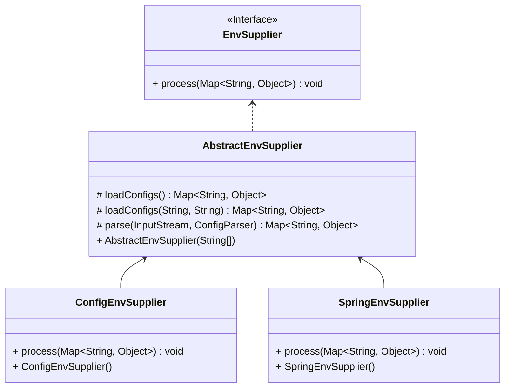

Configuration Reference Manual
===

## 1. Configuration Files

### 1.1 Configuration File Directory

```bash
├── config
│   ├── bootstrap.properties
│   ├── config.yaml
│   ├── lanes.json
│   ├── livespaces.json
│   ├── logback.xml
│   └── microservice.json
```

| File | Description                    |
|------|--------------------------------|
| bootstrap.properties   | Startup-related configurations                |
| config.yaml   | Contains enhancement configurations, plugin definitions, and multi-active traffic governance strategies |
| logback.xml   | Logging configurations                  |
| livespaces.json   | Local multi-active strategy                |
| lanes.json   | Local lane strategy                |
| microservice.json   | Local microservice strategy               |

### 1.2 `bootstrap.properties`

Contains application information and class loader configurations.

```properties
app.name=${APPLICATION_NAME}
app.service.name=${APPLICATION_SERVICE_NAME:${APPLICATION_NAME}}
app.service.namespace=${APPLICATION_SERVICE_NAMESPACE}
app.service.group=${APPLICATION_SERVICE_GROUP}
app.service.gateway=${APPLICATION_SERVICE_GATEWAY:NONE}
app.service.port=${APPLICATION_SERVICE_PORT}
app.service.weight=${APPLICATION_SERVICE_WEIGHT:100}
app.service.warmupDuration=${APPLICATION_SERVICE_WARMUP_DURATION}
app.service.meta=${APPLICATION_SERVICE_META:}
app.location.cloud=${APPLICATION_LOCATION_CLOUD:}
app.location.region=${APPLICATION_LOCATION_REGION}
app.location.zone=${APPLICATION_LOCATION_ZONE}
app.location.cluster=${APPLICATION_LOCATION_CLUSTER}
app.location.liveSpaceId=${APPLICATION_LOCATION_LIVESPACE_ID:${CONFIG_LIVESPACE_ID}}
app.location.unitRuleId=${APPLICATION_LOCATION_UNIT_RULE_ID}
app.location.unit=${APPLICATION_LOCATION_UNIT}
app.location.cell=${APPLICATION_LOCATION_CELL:${NODE_CELL}}
app.location.laneSpaceId=${APPLICATION_LOCATION_LANESPACE_ID}
app.location.lane=${APPLICATION_LOCATION_LANE}
agent.enhance.shutdownOnError=${CONFIG_ENHANCE_SHUTDOWN_ON_ERROR:true}
agent.enhance.excludeApp=${CONFIG_ENHANCE_EXCLUDE_APPS:com.taobao.arthas.boot.Bootstrap,org.netbeans.Main,com.jdk.JDKVersionHelper,com.tongweb.srv.commons.utils.*}
classloader.core.configExtensions=yaml,yml,xml,json,properties
classloader.core.parentPrefixes=com.jd.live.agent.bootstrap.
classloader.core.selfPrefixes=com.jd.live.agent.core.
classloader.core.isolationPrefixes=META-INF/services/com.jd.live.agent
classloader.coreImpl.parentPrefixes=com.jd.live.agent.bootstrap.,com.jd.live.agent.core.,com.jd.live.agent.governance.
classloader.coreImpl.selfPrefixes=com.jd.live.agent.implement.,com.jd.live.agent.shaded.
classloader.plugin.parentPrefixes=com.jd.live.agent.bootstrap.,com.jd.live.agent.core.,com.jd.live.agent.governance.
classloader.plugin.selfPrefixes=com.jd.live.agent.plugin.
```

## 1.2 `config.yaml`

Contains enhancement configurations, plugin definitions, and multi-active traffic governance strategies.

Its structure is as follows:

```yaml
agent:
  enhance: # Bytecode enhancement configurations
  timer: # Timer configurations
  publisher: # Event bus configurations
  plugin: # Plugin configurations
  sync: # Strategy synchronization configurations
  watchdog: # File change monitoring configurations
  switch: # System switches
  governance: # Governance configurations
  counter: # Traffic statistics configurations
```

## 1.3 `livespaces.json`

Refer to [Multi-active Governance Model](./livespace.md).

## 1.4 `microservice.json`

Refer to [Microservice Governance Model](./governance.md).

## 1.5 `lanes.json`

Refer to [Lane Model](./lane.md).

## 2. Environment Variables

The values of configuration items in `bootstrap.properties` and `config.yaml` support environment variable placeholders. The supported formats are as follows:
- `${KEY}`
- `${KEY:defaultValue}`
- `${KEY:${KEY2}}`

> It is recommended to use uppercase for environment variable names.

### 2.1 Sources of Environment Variables

1. System environment variables

`System.getenv()`

2. System properties

`System.getProperties()`

3. Application resource files

`live-agent.properties` in the application's classpath

4. Application name

`application.properties`, `application.yaml`, or `application.yml`

5. Extended implementation of environment providers
```java
@Extensible
public interface EnvSupplier {
    
    void process(Map<String, Object> env);
    
}
```


1. `ConfigEnvSupplier` loads `live-agent.properties` from the application resource path.
2. `SpringEnvSupplier` loads the application name from the application resource path.

### 2.2 Common Environment Variables

For more details, refer to the configurations in `bootstrap.properties` and `config.yaml`.

| Name                                | Description          | Required | Default    | Details                                                                                                      |
|-------------------------------------|----------------------|----------|------------|--------------------------------------------------------------------------------------------------------------|
| APPLICATION_NAME                    | Application name     | Yes      |            | Recommended to be consistent with Spring application name                                                    |
| APPLICATION_SERVICE_NAME            | Service name         | No       | App name   | Recommended to be consistent with Spring Cloud application name                                              |
| APPLICATION_LOCATION_LIVESPACE_ID   | Multi-active space ID | Yes      |            |                                                                                                              |
| APPLICATION_LOCATION_UNIT           | Unit code            | Yes      |            |                                                                                                              |
| APPLICATION_LOCATION_CELL           | Cell code            | Yes      |            |                                                                                                              |
| APPLICATION_LOCATION_LANESPACE_ID   | Lane space ID        | No       |            | Required when lane service is enabled                                                                        |
| APPLICATION_LOCATION_LANE           | Lane code            | No       |            | Required when lane service is enabled                                                                        |
| APPLICATION_LOCATION_REGION         | Region               | No       |            |                                                                                                              |
| APPLICATION_LOCATION_ZONE           | Availability zone    | No       |            |                                                                                                              |
| CONFIG_LIVE_ENABLED                 | Enable multi-active flow control | No | false    | Whether to enable multi-active flow control                                                                  |
| CONFIG_FLOW_CONTROL_ENABLED         | Enable service flow control | No | true     | Enables service flow control including rate limiting, circuit breaking, load balancing, tag routing, etc.    |
| CONFIG_LANE_ENABLED                 | Enable lane flow control | No    | false    | Enables lane flow control                                                                                   |
| CONFIG_PROTECT_ENABLED              | Enable data protection and failover | No | false |                                                                                                              |
| CONFIG_LIVE_MQ_ENABLED              | Enable MQ governance | No       | false    |                                                                                                              |
| CONFIG_CENTER_ENABLED               | Enable config injection | No     | false    | Injects dynamic configurations for Spring applications                                                       |
| CONFIG_WARMUP_SERVICES              | Warm-up services     | No       |           | Microservice names for warm-up, separated by semicolons or commas                                           |
| CONFIG_REGISTRY_ENABLED             | Enable multi-registration and subscription | No | false |                                                                                                              |
| CONFIG_REGISTER_APP_SERVICE_ENABLED | Enable application service registration | No | false |                                                                                                              |
| CONFIG_COUNTER_EXPORTER_TYPE        | Metrics exporter type | No      | logging   | <li>logging: Log</li><li>otlp.grpc: OTLP gRPC</li><li>otlp.http: OTLP HTTP</li><li>prometheus: Prometheus</li> |
| CONFIG_COUNTER_EXPORTER_ENDPOINT    | Metrics exporter endpoint | No    |           | Required when type is otlp.grpc, otlp.http or prometheus                                                    |
