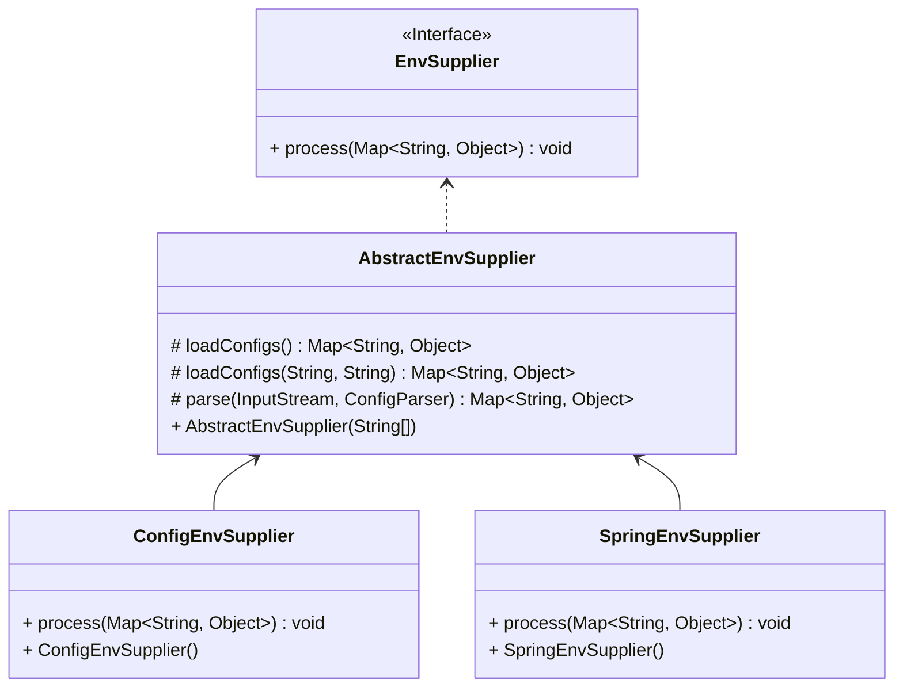

Configuration Reference Manual
===

## 1. Environment Variables

The configuration file supports environment variable placeholders.

### 1.1 Sources of Environment Variables
1. System Environment Variables

`System.getenv()`

2. System Properties

`System.getProperties()`

3. Application Resource File

`live-agent.properties`

4. Application Name

`application.properties`, `application.yaml`, or `application.yml`

5. Extended Implementation Environment Provider
```java
@Extensible
public interface EnvSupplier {
    
    void process(Map<String, Object> env);
    
}
```


1. `ConfigEnvSupplier` loads `live-agent.properties` from the application resource path.
2. `SpringEnvSupplier` loads the application name from the application resource path.

### 1.2 Common Environment Variables

| Name                              | Description        | Required | Default   | Notes                                                     |
|-----------------------------------|--------------------|----------|-----------|----------------------------------------------------------|
| APPLICATION_NAME                  | Application Name   | Yes      |           | Recommended to be consistent with the Spring application name |
| APPLICATION_SERVICE_NAME          | Service Name       | No       | App Name  | Recommended to be consistent with the Spring Cloud application name |
| APPLICATION_LOCATION_LIVESPACE_ID | Instance Live Space ID | Yes  |           |                                                          |
| APPLICATION_LOCATION_UNIT         | Instance Unit Code | Yes      |           |                                                          |
| APPLICATION_LOCATION_CELL         | Instance Partition Code | Yes |           |                                                          |
| APPLICATION_LOCATION_LANESPACE_ID | Instance Lane Space ID | No   |           | Configured when lane service is enabled                   |
| APPLICATION_LOCATION_LANE         | Instance Lane Code | No       |           | Configured when lane service is enabled                   |
| APPLICATION_LOCATION_REGION       | Instance Region    | No       |           |                                                          |
| APPLICATION_LOCATION_ZONE         | Instance Availability Zone | No |           |                                                          |
| CONFIG_LIVE_ENABLED               | Enable Live Flow Control | No | true      | Whether to enable live flow control                      |
| CONFIG_POLICY_INITIALIZE_TIMEOUT  | Policy Sync Timeout | No      | 10000(ms) |                                                          |
| CONFIG_FLOW_CONTROL_ENABLED       | Enable Service Flow Control | No | true  | Enable service flow control, including rate limiting, circuit breaking, load balancing, tag routing, etc. |
| CONFIG_LANE_ENABLED               | Enable Lane Flow Control | No | true      | Enable lane flow control                                  |
| CONFIG_WARMUP_SERVICES            | Warmup Services    | No       |           | Configure the names of microservices to warm up, separated by semicolons or commas |
```


