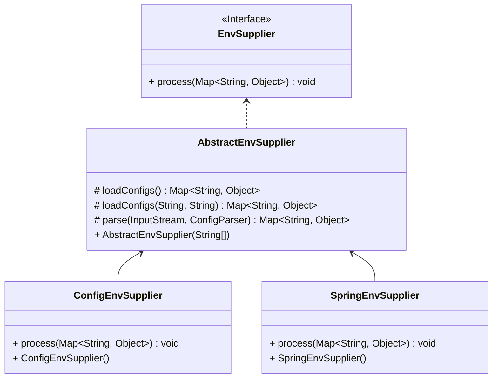

Configuration Reference Manual
===

## 1. Configuration Files

### 1.1 Configuration File Directory

```bash
├── config
│   ├── bootstrap.properties
│   ├── config.yaml
│   ├── lanes.json
│   ├── livespaces.json
│   ├── logback.xml
│   └── microservice.json
```

| File | Description                    |
|------|--------------------------------|
| bootstrap.properties   | Startup-related configurations                |
| config.yaml   | Contains enhancement configurations, plugin definitions, and multi-active traffic governance strategies |
| logback.xml   | Logging configurations                  |
| livespaces.json   | Local multi-active strategy                |
| lanes.json   | Local lane strategy                |
| microservice.json   | Local microservice strategy               |

### 1.2 `bootstrap.properties`

Contains application information and class loader configurations.

```properties
app.name=${APPLICATION_NAME}
app.service.name=${APPLICATION_SERVICE_NAME:${APPLICATION_NAME}}
app.service.namespace=${APPLICATION_SERVICE_NAMESPACE:default}
app.service.group=${APPLICATION_SERVICE_GROUP:default}
app.service.gateway=${APPLICATION_SERVICE_GATEWAY:NONE}
app.location.region=${APPLICATION_LOCATION_REGION}
app.location.zone=${APPLICATION_LOCATION_ZONE}
app.location.liveSpaceId=${APPLICATION_LOCATION_LIVESPACE_ID:${CONFIG_LIVESPACE_ID}}
app.location.unitRuleId=${APPLICATION_LOCATION_UNIT_RULE_ID}
app.location.unit=${APPLICATION_LOCATION_UNIT}
app.location.cell=${APPLICATION_LOCATION_CELL}
app.location.laneSpaceId=${APPLICATION_LOCATION_LANESPACE_ID}
app.location.lane=${APPLICATION_LOCATION_LANE}
agent.enhance.shutdownOnError=${CONFIG_ENHANCE_SHUTDOWN_ON_ERROR:true}
```

## 1.2 `config.yaml`

Contains enhancement configurations, plugin definitions, and multi-active traffic governance strategies.

Its structure is as follows:

```yaml
agent:
  enhance: # Bytecode enhancement configurations
  publisher: # Event bus configurations
  plugin: # Plugin configurations
  sync: # Strategy synchronization configurations
  watchdog: # File change monitoring configurations
  switch: # System switches
  governance: # Governance configurations
  counter: # Traffic statistics configurations
```

### 1.2.1 Bytecode

## 1.3 `livespaces.json`

Refer to [Multi-active Governance Model](./livespace.md).

## 1.4 `microservice.json`

Refer to [Microservice Governance Model](./governance.md).

## 1.5 `lanes.json`

Refer to [Lane Model](./lane.md).

## 2. Environment Variables

The values of configuration items in `bootstrap.properties` and `config.yaml` support environment variable placeholders. The supported formats are as follows:
- `${KEY}`
- `${KEY:defaultValue}`
- `${KEY:${KEY2}}`

> It is recommended to use uppercase for environment variable names.

### 2.1 Sources of Environment Variables

1. System environment variables

`System.getenv()`

2. System properties

`System.getProperties()`

3. Application resource files

`live-agent.properties` in the application's classpath

4. Application name

`application.properties`, `application.yaml`, or `application.yml`

5. Extended implementation of environment providers
```java
@Extensible
public interface EnvSupplier {
    
    void process(Map<String, Object> env);
    
}
```


1. `ConfigEnvSupplier` loads `live-agent.properties` from the application resource path.
2. `SpringEnvSupplier` loads the application name from the application resource path.

### 2.2 Common Environment Variables

For more details, refer to the configurations in `bootstrap.properties` and `config.yaml`.

| Name                              | Description               | Required | Default Value    | Notes                                                     |
|-----------------------------------|---------------------------|----------|------------------|-----------------------------------------------------------|
| APPLICATION_NAME                  | Application name          | Yes      |                  | Recommended to be consistent with the Spring application name |
| APPLICATION_SERVICE_NAME          | Service name              | No       | Application name | Recommended to be consistent with the SpringCloud application name |
| APPLICATION_LOCATION_LIVESPACE_ID | Instance live space ID    | Yes      |                  |                                                           |
| APPLICATION_LOCATION_UNIT         | Instance unit code        | Yes      |                  |                                                           |
| APPLICATION_LOCATION_CELL         | Instance cell code        | Yes      |                  |                                                           |
| APPLICATION_LOCATION_LANESPACE_ID | Instance lane space ID    | No       |                  | Configured when lane service is enabled                   |
| APPLICATION_LOCATION_LANE         | Instance lane code        | No       |                  | Configured when lane service is enabled                   |
| APPLICATION_LOCATION_REGION       | Instance region           | No       |                  |                                                           |
| APPLICATION_LOCATION_ZONE         | Instance availability zone| No       |                  |                                                           |
| CONFIG_LIVE_ENABLED               | Enable multi-active control| No      | true             | Whether to enable multi-active traffic control            |
| CONFIG_POLICY_INITIALIZE_TIMEOUT  | Strategy synchronization timeout | No  | 10000(ms)       |                                                           |
| CONFIG_FLOW_CONTROL_ENABLED       | Enable service control    | No       | true             | Enable service control, including rate limiting, circuit breaking, load balancing, and tag routing strategies |
| CONFIG_LANE_ENABLED               | Enable lane control       | No       | true             | Enable lane control                                       |
| CONFIG_WARMUP_SERVICES            | Warm-up services          | No       |                  | Configure the names of the microservices to warm up, separated by semicolons or commas |