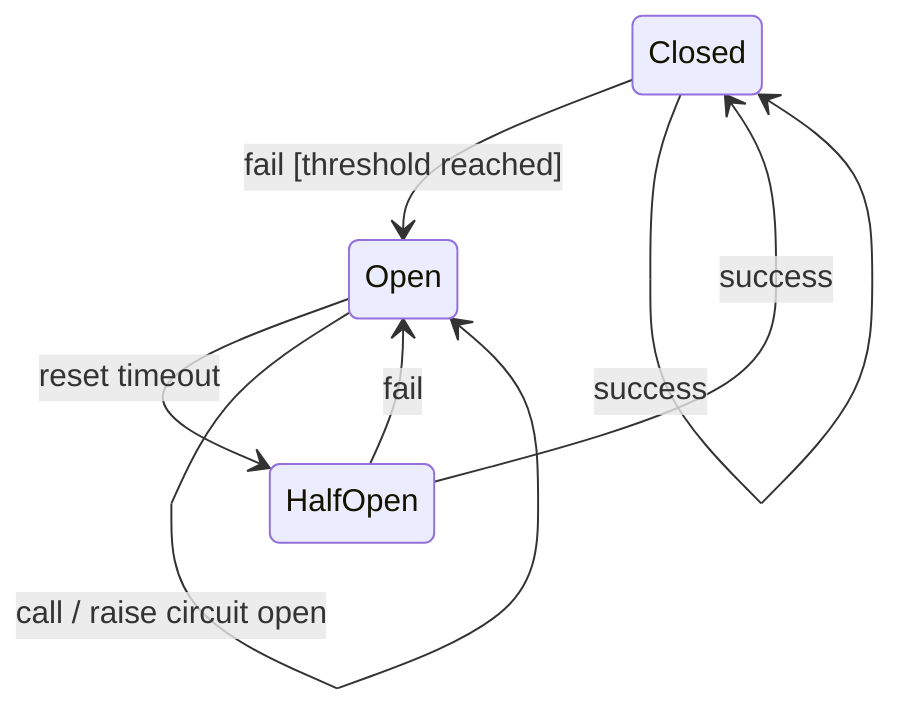

Service Governance Model
===

## 1. Unified Governance Hierarchy

Unified governance strategy configuration hierarchy for HTTP and traditional RPC.

```
.
└── Service
    ├── Group*
    │   ├── Path*
    │   │   ├── Method*

```
Service governance strategies are placed on groups, paths, and methods. They can be set step by step, with lower levels inheriting the configurations of higher levels by default.

The default strategy for a service is set on the default group `default`.

| Type        | Service  | Group | Path    | Method     |
|-------------|----------|-------|---------|------------|
| HTTP        | Domain   | Group | URL Path| HTTP Method|
| RPC App-Level Registration | App Name | Group | Interface Name | Method Name |
| RPC Interface-Level Registration | Interface Name | Group | /     | Method Name |

## 2. Service Strategies
### 2.1 Multi-Active Service Strategy

| Element       | Description                         |
|---------------|-------------------------------------|
| Write Protect | Whether to write methods, needs to be disabled during disaster recovery |
| Variable Expression | In unitization scenarios, can set routing variables from method parameters |
| Unit Policy   | Non-unitized, Local Unit Preferred, Unitized and Central |
| Default Unit Fault Tolerance Threshold | Under the local unit preferred strategy, cross-unit access is allowed when unit metrics are below this threshold |
| Unit Fault Tolerance Threshold | Set the fault tolerance threshold for each unit |
| Partition Policy | Local Partition Preferred, Unlimited |
| Default Partition Fault Tolerance Threshold | Under the local partition preferred strategy, cross-unit access is allowed when partition metrics are below this threshold |
| Partition Fault Tolerance Threshold | Set the fault tolerance threshold for each partition |

```json
{
  "writeProtect": false,
  "variableExpression": null,
  "unitPolicy": "PREFER_LOCAL_UNIT",
  "defaultUnitThreshold": 1,
  "unitRemotes": [
    {
      "name": "unit2",
      "type": "INSTANCES",
      "threshold": 1
    }
  ],
  "cellPolicy": "PREFER_LOCAL_CELL",
  "defaultCellThreshold": 3,
  "cellRemotes": [
    {
      "name": "cell1",
      "type": "INSTANCES",
      "threshold": 4
    }
  ]
}
```

### 2.2 Service Lane Strategy

| Element        | Description                                                                                                                                           |
|----------------|-------------------------------------------------------------------------------------------------------------------------------------------------------|
| Auto Join Lane | Whether to automatically join the lane routing when the application is deployed to a certain lane.<br/>`true` Automatically join;<br/>`false` Do not automatically join, follow the configured lane strategy;<br/>`null` Inherit the configuration from the parent or lane, with the default lane configuration being to automatically join |
| Lane Space     | Configure participation in specific lane spaces and lane routes                                                                                       |

```json
{
  "autoLaneEnabled": true,
  "lanePolicies": [
    {
      "laneSpaceId": "lane-space-1",
      "lanes": {
        "gray": "beta"
      }
    }
  ]
}
```
> This strategy describes automatically joining lanes. In the lane space `lane-space-1`, it redirects the traffic of lane `gray` to lane `beta`.

### 2.3 Service Cluster Strategy

| Element   | Description                                            |
|-----------|--------------------------------------------------------|
| Type      | Failover, Fast Fail, Fail Tolerance                    |
| Retry Policy | When type is failover, configure retry policy including retry count, retry interval, timeout, retry statuses, and retry exceptions |

```json
{
  "clusterPolicy": {
    "type": "failover",
    "retryPolicy": {
      "retry": 10,
      "retryInterval": 1000,
      "timeout": 5000,
      "retryStatuses": [
        500,
        502
      ],
      "retryExceptions": [
        "java.lang.NullPointerException"
      ]
    }
  }
}
```

### 2.4 Service Load Balancing Strategy

| Element | Description                                                    |
|---------|----------------------------------------------------------------|
| Type    | Random weight and round-robin<br/>1. RANDOM: Random weight;<br/>2. ROUND_ROBIN: Round-robin |
| Sticky  | Sticky strategy<br/>1. NONE: Not enabled;<br/>2. PREFERRED: Prefer to keep sticky nodes;<br/>3. FIXED: Fixed sticky nodes |

```json
{
  "loadBalancePolicy": {
    "policyType": "ROUND_ROBIN",
    "stickyType": "NONE"
  }
}
```

### 2.5 Service Rate Limiting Strategy

| Element     | Description                                    |
|-------------|-----------------------------------------------|
| Name        | Rate limiting strategy name                   |
| Type        | Rate limiting implementation type, including `Resilience4j` and `TokenBucket` |
| Sliding Windows | Configure sliding window information including call count and time window |
| Max Wait Time | Maximum wait time                           |
| Parameters  | Parameters required for rate limiting operations |
| Conditions  | Conditions for enabling rate limiting          |

```json
{
  "rateLimitPolicies": [
    {
      "name": "limit-rule-1",
      "version": 1704038400000,
      "realizeType": "Resilience4j",
      "slidingWindows": [
        {
          "threshold": 1,
          "timeWindowInMs": 1000
        },
        {
          "threshold": 3,
          "timeWindowInMs": 2000
        }
      ],
      "maxWaitMs": 100,
      "actionParameters": {
      },
      "relationType": "AND",
      "conditions": [
        {
          "type": "header",
          "opType": "EQUAL",
          "key": "x-live-ext-demo",
          "value": [
            "abc"
          ]
        }
      ]
    }
  ]
}
```

### 2.6 Service Concurrency Control Strategy

| Element    | Description                      |
|------------|----------------------------------|
| Name       | Concurrency control strategy name|
| Type       | Rate limiting implementation type, including `Resilience4j` |
| Max Concurrency | Maximum concurrency         |
| Max Wait Time | Maximum wait time             |
| Parameters  | Parameters required for rate limiting operations |
| Conditions  | Conditions for enabling rate limiting |

```json
{
  "concurrencyLimitPolicies": [
    {
      "name": "limit-rule-2",
      "version": 1704038400000,
      "realizeType": "Resilience4j",
      "maxConcurrency": 10,
      "maxWaitMs": 100,
      "actionParameters": {
      },
      "relationType": "AND",
      "conditions": [
        {
          "type": "header",
          "opType": "EQUAL",
          "key": "x-live-ext-demo",
          "value": [
            "abc"
          ]
        }
      ]
    }
  ]
}
```

### 2.7 Service Tag Routing Strategy

| Element | Description                          |
|---------|--------------------------------------|
| Name    | Strategy name                        |
| Rules   | Define multiple rules, each including enabling conditions, target weights, and target tags |

```json
{
  "routePolicies": [
    {
      "name": "route1",
      "tagRules": [
        {
          "order": 5,
          "relationType": "AND",
          "conditions": [
            {
              "opType": "EQUAL",
              "type": "header",
              "key": "x-live-unit",
              "values": [
                "unit1"
              ]
            }
          ],
          "destinations": [
            {
              "weight": 100,
              "relationType": "AND",
              "conditions": [
                {
                  "opType": "EQUAL",
                  "key": "unit",
                  "values": [
                    "unit1"
                  ]
                }
              ]
            }
          ]
        }
      ]
    }
  ]
}
```

### 2.8 Service Circuit Breaker Strategy



| Element  | Description                           |
|----------|---------------------------------------|
| name     | Policy name                           |
| level       | SERVICE: service level; API: API level; INSTANCE: instance level  |
| slidingWindowType   | Specify the type of sliding window, count: number of times; time: duration           |
| slidingWindowSize   | Specify the size of the sliding window, if it is count, it represents the number of calls; if it is time, it represents seconds |
| minCallsThreshold   | Protect the threshold to prevent applications with too few calls from experiencing a fuse due to occasional failures     |
| errorCodes      | If one of the response codes in the list is returned, it will be recorded as a failure by the circuit breaker      |
| failureRateThreshold   | Failure rate threshold to trigger circuit breaker                        |
| slowCallRateThreshold  | Threshold for the slow call count ratio that triggers circuit breaking                       |
| slowCallDurationThreshold  | How long does a call take to be considered slow                         |
| waitDurationInOpenState     | When the circuit breaker is triggered (status is open), how long should access tokens not be granted           |
| allowedCallsInHalfOpenState | When the circuit breaker enters the half-open state, how many attempts can be allowed for trial access             |
| forceOpen     | Forced to open the fuse                                |
| degradeConfig     | When a fuse occurs, if the degradation configuration is performed, the configuration data will be returned as a response       |

```json
{
  "circuitBreakPolicies": [
    {
      "name": "cb1",
      "level": "SERVICE",
      "slidingWindowType": "count",
      "slidingWindowSize": 5,
      "minCallsThreshold": 1,
      "errorCodes": [
        "500",
        "502"
      ],
      "failureRateThreshold": 20,
      "slowCallRateThreshold": 20,
      "slowCallDurationThreshold": 1000,
      "waitDurationInOpenState": 5000,
      "allowedCallsInHalfOpenState": 3,
      "forceOpen": false,
      "degradeConfig": {
        "responseCode": 200,
        "attributes": {
          "degrade-header-1": "degraded1",
          "degrade-header-2": "degraded2"
        },
        "responseBody": "Hello, your request has been downgraded."
      },
      "version": 1704038400000
    }
  ]
}
```

### 3. Complete Service Strategy Skeleton

Below is the complete service strategy in JSON format.

```json
[
  {
    "name": "service-provider",
    "serviceType": "HTTP",
    "version": 0,
    "groups": [
      {
        "name": "default",
        "defaultGroup": true,
        "servicePolicy": {
          "livePolicy": {
          },
          "lanePolicies": [
          ],
          "clusterPolicy": {
          },
          "loadBalancePolicy": {
          },
          "rateLimitPolicies": [
          ],
          "concurrencyLimitPolicies": [
          ],
          "routePolicies": [
          ],
          "circuitBreakPolicies": [
          ]
        },
        "paths": [
          {
            "path": "/echo",
            "matchType": "EQUAL",
            "servicePolicy": {
            },
            "methods": [
              {
                "name": "GET",
                "servicePolicy": {
                }
              }
            ]
          }
        ]
      }
    ]
  }
]
```