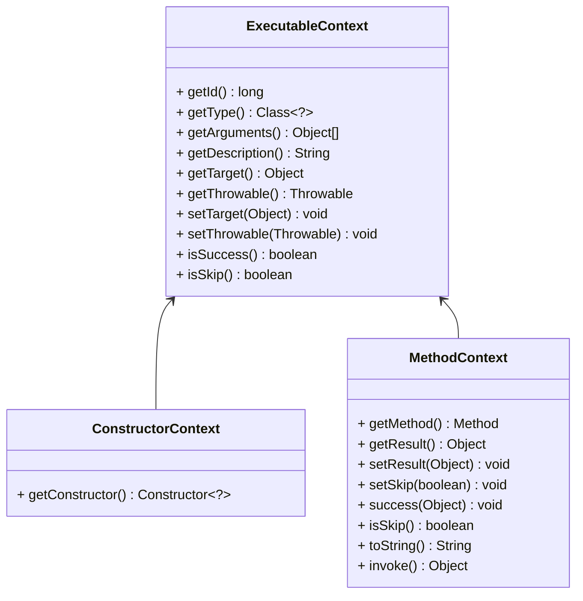

Plugin System
===

Plugins are based on extensions, consisting of multiple extensions to enhance a specific framework, implementing business logic such as multi-active traffic governance.

A plugin is packaged into a directory, as shown below:

```
.
└── plugin
    ├── dubbo
    │   ├── joylive-registry-dubbo2.6-1.0.0.jar
    │   ├── joylive-registry-dubbo2.7-1.0.0.jar
    │   ├── joylive-registry-dubbo3-1.0.0.jar
    │   ├── joylive-router-dubbo2.6-1.0.0.jar
    │   ├── joylive-router-dubbo2.7-1.0.0.jar
    │   ├── joylive-router-dubbo3-1.0.0.jar
    │   ├── joylive-transmission-dubbo2.6-1.0.0.jar
    │   ├── joylive-transmission-dubbo2.7-1.0.0.jar
    │   └── joylive-transmission-dubbo3-1.0.0.jar
```
This Dubbo plugin supports 3 versions, enhancing the capabilities of the registry, routing, and link transmission.

## 1. Plugin Extension Interface

### 1.1 Plugin Definition Interface

This interface describes the matching type and provides method interceptor definitions.

```java
@Extensible("PluginDefinition")
public interface PluginDefinition {
    
    ElementMatcher<TypeDesc> getMatcher();
    
    InterceptorDefinition[] getInterceptors();
}
```

### 1.2 Interceptor Definition Interface

This interface describes the matching methods and interceptors.

```java
public interface InterceptorDefinition {
    
    ElementMatcher<MethodDesc> getMatcher();
    
    Interceptor getInterceptor();
}
```

### 1.3 Interceptor Interface

This interface describes method interception points.

```java
public interface Interceptor {
    
    void onEnter(ExecutableContext ctx);

    void onSuccess(ExecutableContext ctx);

    void onError(ExecutableContext ctx);

    void onExit(ExecutableContext ctx);
}
```

### 1.4 Context Object

`ExecutableContext` has different implementations for intercepting member methods and constructors, namely `MethodContext` and `ConstructorContext`.



## 2. Plugin Implementation

Taking Dubbo3 as an example, let's see how to implement a business plugin.

### 2.1 The directory structure of the plugin is as follows:

```
.
├── com
│   └── jd
│       └── live
│           └── agent
│               └── plugin
│                   └── router
│                       └── dubbo
│                           └── v3
│                               ├── definition
│                               │   ├── ClassLoaderFilterDefinition.java
│                               │   ├── ClusterDefinition.java
│                               │   └── LoadBalanceDefinition.java
│                               ├── instance
│                               │   └── DubboEndpoint.java
│                               ├── interceptor
│                               │   ├── ClassLoaderFilterInterceptor.java
│                               │   ├── ClusterInterceptor.java
│                               │   └── LoadBalanceInterceptor.java
│                               ├── request
│                               │   ├── DubboRequest.java
│                               │   └── invoke
│                               │       └── DubboInvocation.java
│                               └── response
│                                   └── DubboResponse.java
└── org
    └── apache
        └── dubbo
            └── rpc
                └── cluster
                    └── support
                        └── DubboCluster3.java
```

1. `definition` is used to store plugin definitions.
2. `interceptor` is used to store interceptors.
3. `request` is used to store request objects.
4. `response` is used to store response objects.
5. `invoke` is used to store invocation objects.
6. `instance` is used to store backend instance objects.
7. The `DubboCluster3` cluster object is placed under `org.apache.dubbo.rpc.cluster.support` for easy access to protected methods.

### 2.2 Dubbo3 Cluster Plugin Definition

```java
@Injectable
@Extension(value = "ClusterDefinition_v2.7")
@ConditionalOnProperty(name = GovernanceConfig.CONFIG_FLOW_CONTROL_ENABLED, matchIfMissing = true)
@ConditionalOnProperty(name = GovernanceConfig.CONFIG_LIVE_DUBBO_ENABLED, matchIfMissing = true)
@ConditionalOnClass(ClusterDefinition.TYPE_ABSTRACT_CLUSTER)
@ConditionalOnClass(ClassLoaderFilterDefinition.TYPE_CONSUMER_CLASSLOADER_FILTER)
public class ClusterDefinition extends PluginDefinitionAdapter {

    protected static final String TYPE_ABSTRACT_CLUSTER = "org.apache.dubbo.rpc.cluster.support.AbstractClusterInvoker";

    private static final String METHOD_DO_INVOKE = "doInvoke";

    private static final String[] ARGUMENT_DO_INVOKE = new String[]{
            "org.apache.dubbo.rpc.Invocation",
            "java.util.List",
            "org.apache.dubbo.rpc.cluster.LoadBalance"
    };

    @Inject(InvocationContext.COMPONENT_INVOCATION_CONTEXT)
    private InvocationContext context;

    public ClusterDefinition() {
        this.matcher = () -> MatcherBuilder.isSubTypeOf(TYPE_ABSTRACT_CLUSTER)
                .and(MatcherBuilder.not(MatcherBuilder.isAbstract()));
        this.interceptors = new InterceptorDefinition[]{
                new InterceptorDefinitionAdapter(
                        MatcherBuilder.named(METHOD_DO_INVOKE)
                                .and(MatcherBuilder.arguments(ARGUMENT_DO_INVOKE)),
                        () -> new ClusterInterceptor(context)
                )
        };
    }
}
```
1. The plugin definition inherits from `PluginDefinitionAdapter`, implementing the `PluginDefinition` interface.
2. The plugin declares the extension implementation with `@Extension`.
3. The plugin declares multiple extension enabling conditions, describing that it is enabled when flow control is enabled, Dubbo is enabled, and it is running in the Dubbo3 environment.
4. The plugin injects the invocation context `InvocationContext` to facilitate multi-active traffic control.
5. In the constructor, the plugin uses `MatcherBuilder` to describe the classes and methods to be intercepted.

### 2.3 Dubbo3 Cluster Plugin Interceptor

```java
public class ClusterInterceptor extends InterceptorAdaptor {

    private final InvocationContext context;

    private final Map<AbstractClusterInvoker<?>, DubboCluster3> clusters = new ConcurrentHashMap<>();

    public ClusterInterceptor(InvocationContext context) {
        this.context = context;
    }
    
    @Override
    public void onEnter(ExecutableContext ctx) {
        MethodContext mc = (MethodContext) ctx;
        Object[] arguments = ctx.getArguments();
        DubboCluster3 cluster = clusters.computeIfAbsent((AbstractClusterInvoker<?>) ctx.getTarget(), DubboCluster3::new);
        List<Invoker<?>> invokers = (List<Invoker<?>>) arguments[1];
        List<DubboEndpoint<?>> instances = invokers.stream().map(DubboEndpoint::of).collect(Collectors.toList());
        DubboOutboundRequest request = new DubboOutboundRequest((Invocation) arguments[0]);
        DubboOutboundInvocation invocation = new DubboOutboundInvocation(request, context);
        DubboOutboundResponse response = cluster.request(context, invocation, instances);
        if (response.getThrowable() != null) {
            mc.setThrowable(response.getThrowable());
        } else {
            mc.setResult(response.getResponse());
        }
        mc.setSkip(true);
    }

}
```
1. The interceptor declares interception on method entry using `onEnter`.
2. It retrieves the method parameters through the context.
3. It creates a cluster object, backend instance list, request object, and invocation object based on the parameters.
4. It synchronously calls to get a response based on the cluster's strategy.
5. It sets the response based on the invocation interface and skips the original method's processing.