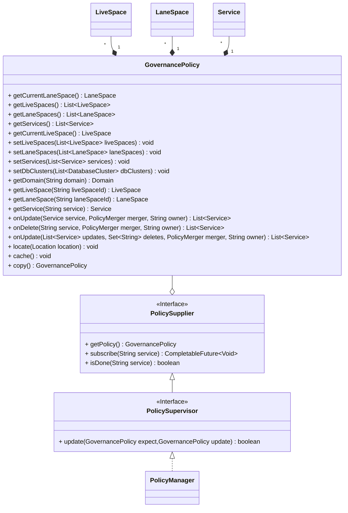

Strategy Synchronization
===

## 1. Strategy Management



- `PolicySupplier` provides methods to get the latest governance policies and can subscribe to service policies.
- `PolicyManager` is an extended implementation of `PolicySupplier` and can be injected into required plugins. For more details on injection, refer to [Extension System](extension.md).
- `GovernancePolicy` aggregates currently supported governance policies, including multi-active space, lane space, microservices, and databases. Microservice policies can come from multiple providers. It offers methods for updating and merging service policies.

## 2. Synchronization Methods

The system has built-in file synchronization and some remote synchronization capabilities. Configuration can be done in `config.yaml`.

```yaml
agent:
  sync:
    liveSpace:
      type: ${CONFIG_LIVE_SPACE_API_TYPE:file} # [file,multilive]
```

### 2.1 File Synchronization

The system has built-in strategy files for multi-active space, lane space, and microservices, supporting dynamic updates.

The default synchronization type is file synchronization. Set the `type` value to `file` to enable file synchronization.

```
├── config
│   ├── lanes.json
│   ├── livespaces.json
│   └── microservice.json
```

### 2.2 Control Plane Synchronization

The system has built-in synchronization implementations for the multi-active control plane. You can refer to these implementations for microservice and lane synchronization.

#### 2.2.1 Live Space Synchronization

Sample configuration file:

```yaml
agent:
  sync:
    liveSpace:
      type: multilive
      url: http://api.live.local:9090/v1
      #spacesUrl: ${CONFIG_LIVE_SPACE_API_URL}/workspaces
      #spaceUrl: ${CONFIG_LIVE_SPACE_API_URL}/workspaces/${space_id}/version/${space_version}
      #serviceUrl: ${CONFIG_LIVE_SPACE_API_URL}/services/${service_name}/version/${service_version}
      service: true
      interval: 5000
      timeout: 3000
      initialTimeout: 20000
      delay: 0
      fault: 5000
      headers: 
        key1: value1
        key2: value2
```

| Property        | Name                                   | Description                                                                 |
|-----------------|----------------------------------------|-----------------------------------------------------------------------------|
| type            | Type                                   | Set to `multilive`                                                          |
| url             | Synchronization URL                    |                                                                             |
| spacesUrl       | Space Sync URL                         | Optional, defaults to adding a subpath to the URL                           |
| serviceUrl      | Service Sync URL                       | Optional, defaults to adding a subpath to the URL                           |
| service         | Microservice Live Strategy Sync Switch | `true` to enable microservice multi-active strategy sync from the control plane<br/>`false` to disable it |
| interval        | Sync Interval                          | In milliseconds                                                             |
| timeout         | Timeout                                | Request timeout                                                             |
| initialTimeout  | Initial Timeout                        | In milliseconds                                                             |
| delay           | Sync Initialization Delay              | In milliseconds                                                             |
| fault           | Fault Recovery Sync Time               | In milliseconds                                                             |
| headers         | Headers                                | Can store additional information such as keys                               |