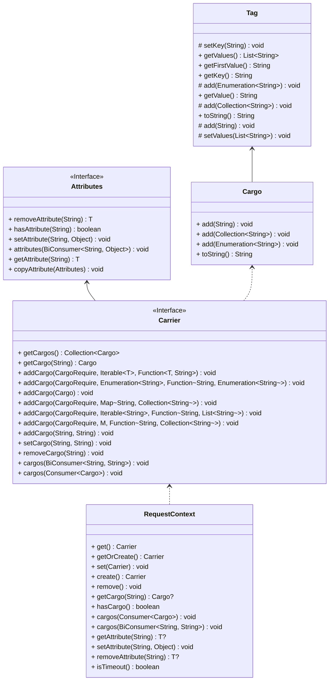
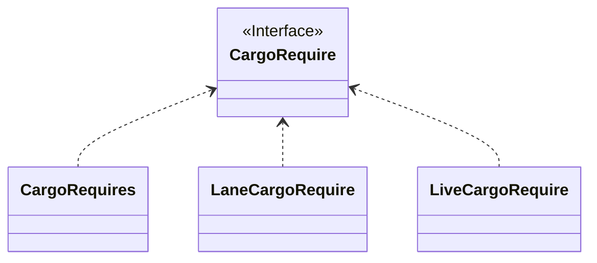

Link Transmission
===

In multi-live and lane scenarios, it is necessary to transmit multi-live unit information and lane information to ensure that traffic remains within the unit or lane as much as possible.

## 1. Request Context

The request context `RequestContext` carries information through thread variables `Carrier`.


## 2. Define Information to be Transmitted

Define the information to be restored to the context based on extensions.


1. `CargoRequire` defines the information to be transmitted and describes it as an extension interface.
2. `LiveCargoRequire` is a built-in implementation of multi-live transmission definition.
3. `LaneCargoRequire` is a built-in implementation of multi-lane transmission definition.
4. `CargoRequires` is used to aggregate all `CargoRequire` implementations.

| Key               | Description         |
|-------------------|---------------------|
| x-live-space-id   | Multi-live space ID |
| x-live-rule-id    | Multi-live space route ID |
| x-live-uid        | Multi-live space route variable |
| x-live-           | Multi-live prefix match |
| x-lane-space-id   | Lane space ID       |
| x-lane-code       | Lane code           |

## 3. Transmission Implementation

On the service caller side, intercept the method request and set the context variables that need to be transmitted into the transmission object. On the service provider side, intercept the request processing and restore the transmitted information into the context.

1. HTTP calls use Headers for transmission.
2. RPC calls use Attachments for transmission.
3. MQ calls use Attachments for transmission.

Below is an example of the transmission implementation using Dubbo3.

### 3.1 Consumer

#### 3.1.1 Consumer Plugin Definition

```java
@Extension(value = "DubboConsumerDefinition_v3", order = PluginDefinition.ORDER_TRANSMISSION)
@Injectable
@ConditionalOnProperties(value = {
        @ConditionalOnProperty(value = GovernanceConfig.CONFIG_LIVE_ENABLED, matchIfMissing = true),
        @ConditionalOnProperty(value = GovernanceConfig.CONFIG_LANE_ENABLED, matchIfMissing = true)
}, relation = ConditionalRelation.OR)
@ConditionalOnClass(DubboConsumerDefinition.TYPE_CONSUMER_CONTEXT_FILTER)
public class DubboConsumerDefinition extends PluginDefinitionAdapter {

    public static final String TYPE_CONSUMER_CONTEXT_FILTER = "org.apache.dubbo.rpc.cluster.filter.support.ConsumerContextFilter";

    private static final String METHOD_INVOKE = "invoke";

    protected static final String[] ARGUMENT_INVOKE = new String[]{
            "org.apache.dubbo.rpc.Invoker",
            "org.apache.dubbo.rpc.Invocation"
    };

    @Inject
    @InjectLoader(ResourcerType.CORE_IMPL)
    private List<CargoRequire> requires;

    public DubboConsumerDefinition() {

        this.matcher = () -> MatcherBuilder.named(TYPE_CONSUMER_CONTEXT_FILTER);
        this.interceptors = new InterceptorDefinition[]{
                new InterceptorDefinitionAdapter(
                        MatcherBuilder.named(METHOD_INVOKE).
                                and(MatcherBuilder.arguments(ARGUMENT_INVOKE)),
                        () -> new DubboConsumerInterceptor(requires))};
    }
}
```

This plugin definition describes intercepting the method `invoke` of the type `org.apache.dubbo.rpc.cluster.filter.support.ConsumerContextFilter`.

#### 3.1.2 Consumer Interceptor

```java
public class DubboConsumerInterceptor extends InterceptorAdaptor {

    private final CargoRequire require;

    public DubboConsumerInterceptor(List<CargoRequire> requires) {
        this.require = new CargoRequires(requires);
    }

    @Override
    public void onEnter(ExecutableContext ctx) {
        attachTag((RpcInvocation) ctx.getArguments()[1]);
    }

    private void attachTag(RpcInvocation invocation) {
        Carrier carrier = RequestContext.getOrCreate();
        carrier.cargos(tag -> invocation.setAttachment(tag.getKey(), tag.getValue()));
        carrier.addCargo(require, RpcContext.getClientAttachment().getObjectAttachments(), Label::parseValue);
    }

}
```

This interceptor, before entering the method, iterates over all `Cargo` objects, setting them as attachments to the request. It also restores the application-set transmission information from the request into the context.

### 3.2 Service Provider

#### 3.2.1 Service Provider Plugin Definition

```java
@Injectable
@Extension(value = "DubboProviderDefinition_v3", order = PluginDefinition.ORDER_TRANSMISSION)
@ConditionalOnProperties(value = {
        @ConditionalOnProperty(value = GovernanceConfig.CONFIG_LIVE_ENABLED, matchIfMissing = true),
        @ConditionalOnProperty(value = GovernanceConfig.CONFIG_LANE_ENABLED, matchIfMissing = true)
}, relation = ConditionalRelation.OR)
@ConditionalOnClass(DubboConsumerDefinition.TYPE_CONSUMER_CONTEXT_FILTER)
@ConditionalOnClass(DubboProviderDefinition.TYPE_CONTEXT_FILTER)
public class DubboProviderDefinition extends PluginDefinitionAdapter {

    protected static final String TYPE_CONTEXT_FILTER = "org.apache.dubbo.rpc.filter.ContextFilter";

    private static final String METHOD_INVOKE = "invoke";

    @Inject
    @InjectLoader(ResourcerType.CORE_IMPL)
    private List<CargoRequire> requires;

    public DubboProviderDefinition() {
        this.matcher = () -> MatcherBuilder.named(TYPE_CONTEXT_FILTER);
        this.interceptors = new InterceptorDefinition[]{
                new InterceptorDefinitionAdapter(
                        MatcherBuilder.named(METHOD_INVOKE).
                                and(MatcherBuilder.arguments(ARGUMENT_INVOKE)),
                        () -> new DubboProviderInterceptor(requires))};
    }
}
```

This plugin definition describes intercepting the method `invoke` of the type `org.apache.dubbo.rpc.filter.ContextFilter`.

#### 3.2.2 Service Provider Interceptor

```java
public class DubboProviderInterceptor extends InterceptorAdaptor {

    private final CargoRequire require;

    public DubboProviderInterceptor(List<CargoRequire> requires) {
        this.require = new CargoRequires(requires);
    }

    @Override
    public void onEnter(ExecutableContext ctx) {
        restoreTag((RpcInvocation) ctx.getArguments()[1]);
    }

    private void restoreTag(RpcInvocation invocation) {
        RequestContext.create().addCargo(require, invocation.getObjectAttachments(), Label::parseValue);
    }

    @Override
    public void onExit(ExecutableContext ctx) {
        RequestContext.remove();
    }

}
```

This interceptor restores the necessary context transmission information from the request when entering the method and removes the context after the chain processing is completed.
```