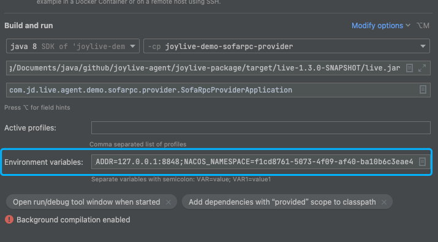
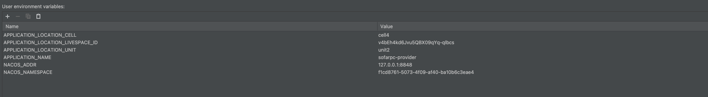

# 注意点
`sofarpc-demo`这个模块可以用jdk8正常编译运行;但是如果在终端对整个项目编译，则需要将jdk版本设置为17，推荐安装`jenv`动态切换jdk版本
> 列出可选的jdk版本
```shell
➜  joylive-agent git:(main) ✗ jenv versions
  system
  1.8
* 1.8.0.291 (set by /Users/yuanjinzhong/.jenv/version)
  11
  11.0
  11.0.18
  17
  17.0
  17.0.8
  openjdk64-17.0.8
  oracle64-1.8.0.291
  oracle64-11.0.18

```
> 选择jdk 17
```shell
➜  joylive-agent git:(main) ✗ jenv global  17      
```

# 启动时需要的环境变量



# 接下来
查看 [快速开始](./docs/cn/quickstart.md)
